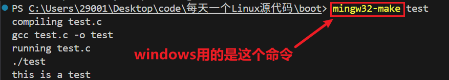
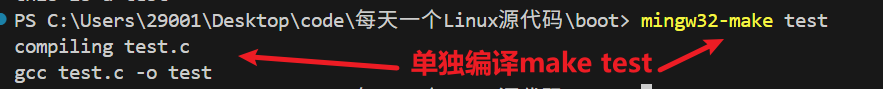
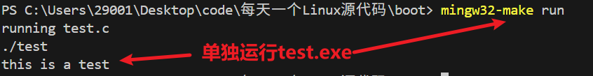
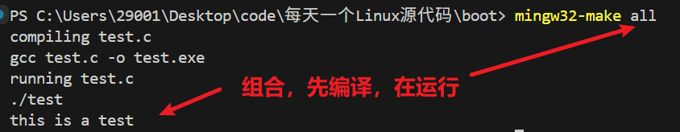
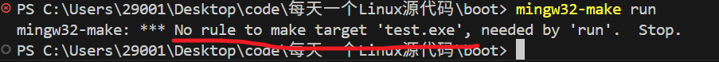
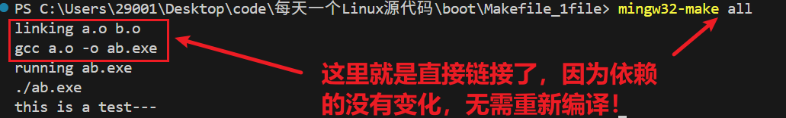
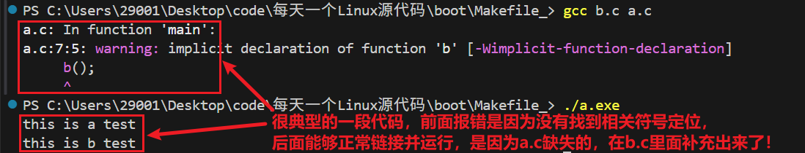
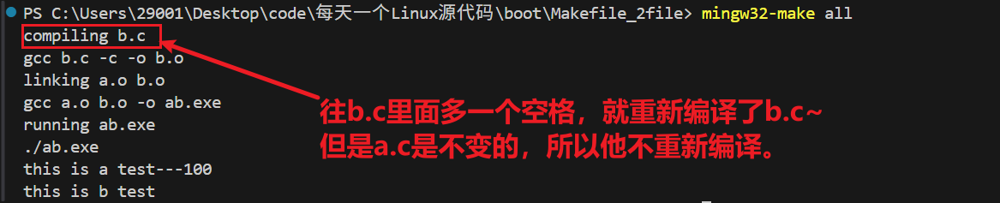

# 一、Makefile基础知识
## (一)Makefile本质
本质：编译构建软件的帮手，将gcc的各种编译命令做一个引擎，便于我们在Makefile中使用。
学习：https://blog.csdn.net/m0_68657832/article/details/142790237

## (二)Makefile命令

### 1.基础讲解


Makefile由`一系列的规则组成`，每个规则包含了`目标`、`依赖`和`执行的命令`。
- `目标`，就是我们要生成的文件。
- `依赖`，就是生成这个文件所需要的文件。
- `命令`，就是生成这个文件的具体步骤。

即如下形式：
```makefile
目标: 依赖
    命令
```

规则其实就是告诉make两件事
——**文件的依赖是什么？** **以及如何生成这个文件？**

比如程序`test.c`：
```c
#include<stdio.h>
int main(){
    printf("this is a test\n");
}
```
我们每次构建都要使用gcc命令：
`gcc test.c -o test`是不是很麻烦，这么长一串？
现在我们可以使用makefile来构建这个程序：
```makefile
test: test.c
    @echo "compiling test.c"
    gcc test.c -o test
```
以后，我们只需要执行`make test`就可以构建这个程序了。
这里的test就是目标，我们要执行的行为的名称就叫test，这个行为的依赖文件即使test.c,用这个依赖文件做的命令就是：`gcc test.c -o test`

截图如下：

我们可以看见，现在我们只需要执行`make test`就可以构建这个程序了。很方便！

### 2.多层组合运行
上述编译和运行写在一起的，怎么将其分开呢？可以使用组合命令
将编译用test命令，运行用run命令，组合起来就是all命令。
这样既可以单独编译，也可以单独运行，还可以一起编译运行。很方便！！！
```makefile
# 1. 定义默认目标：先编译，再运行
all: test run

# 2. 编译规则：仅test.c更新时才重新编译
test: test.c
	@echo "compiling test.c"
	gcc test.c -o test.exe

# 3. 运行规则：依赖test文件，仅test更新时才运行
run: test.exe
	@echo "running test.c"
	./test.exe

# 4.清理目标
clean:
	@echo "cleaning all exe && obj files"
	-rm -f *.exe *.o

# 声明伪目标（避免和同名文件冲突）
.PHONY: all test run clean
```
截图如下：








注意，我们的命令执行时，一定**要先有依赖文件**，这是输入，否则会报错！

 

### 3. 伪命令

那么这里的伪命令又是什么呢？
我们的make命令第一作用的是当前目录下的文件，
如果当前目录下没有这个文件，make才会执行命令。
那显然，如果当前目录下有这个文件，make就会直接作用这个文件，显示文件是不是最新，而非命令。就导致当前命令失效。
我们用.PHONY来声明伪命令就明确告知，**make不去当前目录查看这个文件，而是直接执行命令。**

例如：当目录下存在clean文件并且clean命令没有加入伪命令时，直接作用目标是文件，而非命令，导致clean命令失效


### 4.默认执行第一个命令
当我们执行make的时候，make会`默认执行第一个规则`(具体看你第一个设定的是啥)。


### 5.按需编译(即如果源文件没有改变，就不需要重新编译)
这里采用多文件实现按需编译。多文件也可以。而且常常是多文件时用的多。
#### 单文件按需编译
```c
#include <stdio.h>
int main(void)
{
    printf("this is a test---%d\n",c);
    return 0;
}
```
makefile文件
```makefile
all: a.o
	@echo "linking a.o b.o"
	gcc a.o -o ab.exe
	@echo "running ab.exe"
	./ab.exe

a.o: a.c
	@echo "compiling a.c"
	gcc a.c -c -o a.o

clean:
	rm -f *.o *.exe
```
第一次编译：
第二次编译：


#### 多文件按需编译源码
##### a.c文件：
```c
#include <stdio.h>

extern void b();    //因为本文件引用了，但是却没有定义，所以将定义寄希望于外部合作伙伴，所以加上extern申明一下。
extern int c;
int main(void)
{
    printf("this is a test---%d\n",c);
    b();
    return 0;
}
```
##### b.h文件：
```c
#include <stdio.h>
extern int c;
void b();
```
##### b.c文件：
```c
#include <stdio.h>
int c=100;
void b(){
    printf("this is b test\n");
}
```

#### (1)手动编译链接
手动编译链接命令如下：
```bash
gcc a.c b.c -o a.exe 
```
可以执行。



#### (2)使用makefile编译链接
```c
all: a.o b.o
	@echo "linking a.o b.o"
	gcc a.o b.o -o ab.exe
	@echo "running ab.exe"
	./ab.exe

a.o: a.c
	@echo "compiling a.c"
	gcc a.c -c -o a.o

b.o: b.c
	@echo "compiling b.c"
	gcc b.c -c -o b.o

clean:
	rm -f *.o *.exe
```



### 6.在命令前面加上@表示不打印命令本身，只打印命令执行的输出（如果有，比如@echo等）。
#### 源码：
```c
#include <stdio.h>
int main(void)
{
    printf("this is a test---%d\n",c);
    return 0;
}
```
makefile文件1
```makefile
all: a.o
	@echo "linking a.o b.o"
	gcc a.o -o ab.exe
	@echo "running ab.exe"
	./ab.exe

a.o: a.c
	@echo "compiling a.c"
	gcc a.c -c -o a.o

clean:
	rm -f *.o *.exe
```
makefile文件2
```makefile
all: a.o
	@echo "linking a.o b.o"
	@gcc a.o -o ab.exe
	@echo "running ab.exe"
	@./ab.exe

a.o: a.c
	@echo "compiling a.c"
	@gcc a.c -c -o a.o

clean:
	@rm -f *.o *.exe
```
命令前加上@和不加@的区别对比
