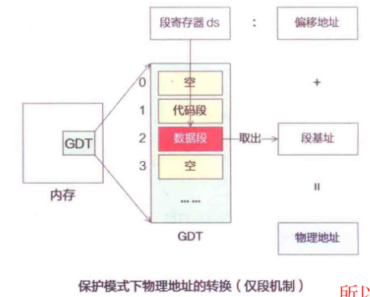

# 一、setup.s 的功能
1.将0x00000处的系统元信息保存到0x90000处，包括光标位置、系统参数、引导扇区信息、磁盘参数等。
2.将system模块从0x10000处移动到0x00000处。
3.设置保护模式下的中断描述符表（IDT）和全局描述符表（GDT）。
4.启用A20地址线。
5.通过将cr0寄存器的末尾位PE置为1，进入保护模式。

# 二、按功能逐行讲解setup.s代码

## (一)正式进入_start程序入口前的准备工作
```s
	.code16
	.equ INITSEG, 0x9000	# bootsect数据块的起始位置
	.equ SYSSEG, 0x1000	# system数据块的起始位置
	.equ SETUPSEG, 0x9020	# setup数据块的起始位置

	.global _start, begtext, begdata, begbss, endtext, enddata, endbss
	.text
	begtext:
	.data
	begdata:
	.bss
	begbss:
	.text

	ljmp $SETUPSEG, $_start	# 跳转到setup数据块的起始位置（cs设置为SETUP段地址，ip设置为下面的_start，程序入口）
```

## (二)正式进入_start程序入口后的工作
收集计算机**硬件核心信息并保存**、可视化展示这些信息，**同时做进入保护模式的前期准备**（检查硬盘、关闭中断、初始化内存搬运参数）。
```s
_start:
	mov %cs,%ax
	mov %ax,%ds
	mov %ax,%es
#
##print some message
#
	mov $0x03, %ah
	xor %bh, %bh
	int $0x10

	mov $29, %cx
	mov $0x000b,%bx
	mov $msg2,%bp
	mov $0x1301, %ax
	int $0x10
# ok, the read went well so we get current cursor position and save it for
# posterity.
	mov	$INITSEG, %ax	# this is done in bootsect already, but...
	mov	%ax, %ds
	mov	$0x03, %ah	# read cursor pos
	xor	%bh, %bh
	int	$0x10		# save it in known place, con_init fetches
	mov	%dx, %ds:0	# it from 0x90000.
# Get memory size (extended mem, kB)

	mov	$0x88, %ah 
	int	$0x15
	mov	%ax, %ds:2

# Get video-card data:

	mov	$0x0f, %ah
	int	$0x10
	mov	%bx, %ds:4	# bh = display page
	mov	%ax, %ds:6	# al = video mode, ah = window width

# check for EGA/VGA and some config parameters

	mov	$0x12, %ah
	mov	$0x10, %bl
	int	$0x10
	mov	%ax, %ds:8
	mov	%bx, %ds:10
	mov	%cx, %ds:12

# Get hd0 data

	mov	$0x0000, %ax
	mov	%ax, %ds
	lds	%ds:4*0x41, %si
	mov	$INITSEG, %ax
	mov	%ax, %es
	mov	$0x0080, %di
	mov	$0x10, %cx
	rep
	movsb

# Get hd1 data

	mov	$0x0000, %ax
	mov	%ax, %ds
	lds	%ds:4*0x46, %si
	mov	$INITSEG, %ax
	mov	%ax, %es
	mov	$0x0090, %di
	mov	$0x10, %cx
	rep
	movsb

## modify ds
	mov $INITSEG,%ax
	mov %ax,%ds
	mov $SETUPSEG,%ax
	mov %ax,%es

##show cursor pos:
	mov $0x03, %ah 
	xor %bh,%bh
	int $0x10
	mov $11,%cx
	mov $0x000c,%bx
	mov $cur,%bp
	mov $0x1301,%ax
	int $0x10
##show detail
	mov %ds:0 ,%ax
	call print_hex
	call print_nl

##show memory size
	mov $0x03, %ah
	xor %bh, %bh
	int $0x10
	mov $12, %cx
	mov $0x000a, %bx
	mov $mem, %bp
	mov $0x1301, %ax
	int $0x10

##show detail
	mov %ds:2 , %ax
	call print_hex

##show 
	mov $0x03, %ah
	xor %bh, %bh
	int $0x10
	mov $25, %cx
	mov $0x000d, %bx
	mov $cyl, %bp
	mov $0x1301, %ax
	int $0x10
##show detail
	mov %ds:0x80, %ax
	call print_hex
	call print_nl

##show 
	mov $0x03, %ah
	xor %bh, %bh
	int $0x10
	mov $8, %cx
	mov $0x000e, %bx
	mov $head, %bp
	mov $0x1301, %ax
	int $0x10
##show detail
	mov %ds:0x82, %ax
	call print_hex
	call print_nl

##show 
	mov $0x03, %ah
	xor %bh, %bh
	int $0x10
	mov $8, %cx
	mov $0x000f, %bx
	mov $sect, %bp
	mov $0x1301, %ax
	int $0x10
##show detail
	mov %ds:0x8e, %ax
	call print_hex
	call print_nl
#l:
#	jmp l
##
# Check that there IS a hd1 :-)

	mov	$0x01500, %ax
	mov	$0x81, %dl
	int	$0x13
	jc	no_disk1
	cmp	$3, %ah
	je	is_disk1
no_disk1:
	mov	$INITSEG, %ax
	mov	%ax, %es
	mov	$0x0090, %di
	mov	$0x10, %cx
	mov	$0x00, %ax
	rep
	stosb
is_disk1:

# now we want to move to protected mode ...

	cli			# no interrupts allowed ! 

# first we move the system to its rightful place

	mov	$0x0000, %ax
	cld			# 'direction'=0, movs moves forward
```

## (三)将system模块从0x10000处移动到0x00000处
```s
do_move:
	mov	%ax, %es	# destination segment
	add	$0x1000, %ax
	cmp	$0x9000, %ax
	jz	end_move
	mov	%ax, %ds	# source segment
	sub	%di, %di
	sub	%si, %si
	mov 	$0x8000, %cx
	rep
	movsw
	jmp	do_move
```

## (四)加载保护模式下的中断描述符表（IDT）和全局描述符表（GDT）
注意了，这里的`lidt	idt_48`表示将idt_48的地址加载到寄存器ldtr中，`lgdt	gdt_48`表示将gdt_48的地址加载到寄存器gdtr中，都是为了告知CPU中断向量表和全局描述符表的地址地址。

```s
# then we load the segment descriptors

end_move:
	mov	$SETUPSEG, %ax	# right, forgot this at first. didnt work :-)
	mov	%ax, %ds
	lidt	idt_48		# load idt with 0,0
	lgdt	gdt_48		# load gdt with whatever appropriate
```

这两个表的具体内容如下：

这些是GDT和idt的具体设置，这里作者只设置了GDT的3个描述符，每一个8字节，第一个是空的，第2个是代码段，第3个是数据段。
由此可以看出，这里的IDT并没有向GDT一样设置具体处理程序的地址。

```s
gdt:
# 8字节，一个表项
# 第1个表项
	.word	0,0,0,0		# dummy

# 第2个表项
	.word	0x07FF		# 8Mb - limit=2047 (2048*4096=8Mb)
	.word	0x0000		# base address=0
	.word	0x9A00		# code read/exec
	.word	0x00C0		# granularity=4096, 386

# 第3个表项
	.word	0x07FF		# 8Mb - limit=2047 (2048*4096=8Mb)
	.word	0x0000		# base address=0
	.word	0x9200		# data read/write
	.word	0x00C0		# granularity=4096, 386

idt_48:
	.word	0			# idt limit=0
	.word	0,0			# idt base=0L

gdt_48:
	.word	0x800			# gdt limit=2048, 256 GDT entries
	.word   512+gdt, 0x9		# gdt base = 0X9xxxx, 
	# 512+gdt is the real gdt after setup is moved to 0x9020 * 0x10
```

## (五)开启A20地址线
```s
# that was painless, now we enable A20

	#call	empty_8042	# 8042 is the keyboard controller
	#mov	$0xD1, %al	# command write
	#out	%al, $0x64
	#call	empty_8042
	#mov	$0xDF, %al	# A20 on
	#out	%al, $0x60
	#call	empty_8042
	inb     $0x92, %al	# open A20 line(Fast Gate A20).
	orb     $0b00000010, %al
	outb    %al, $0x92
```

## (六)解决一些IBM的遗留的中断覆盖问题
IBM在违背了Intel的中断默认设定，我们只能重新纠正，对8269芯片进行编程
```s
	mov	$0x11, %al		# initialization sequence(ICW1)
					# ICW4 needed(1),CASCADE mode,Level-triggered
	out	%al, $0x20		# send it to 8259A-1
	.word	0x00eb,0x00eb		# jmp $+2, jmp $+2
	out	%al, $0xA0		# and to 8259A-2
	.word	0x00eb,0x00eb
	mov	$0x20, %al		# start of hardware int's (0x20)(ICW2)
	out	%al, $0x21		# from 0x20-0x27
	.word	0x00eb,0x00eb
	mov	$0x28, %al		# start of hardware int's 2 (0x28)
	out	%al, $0xA1		# from 0x28-0x2F
	.word	0x00eb,0x00eb		#               IR 7654 3210
	mov	$0x04, %al		# 8259-1 is master(0000 0100) --\
	out	%al, $0x21		#				|
	.word	0x00eb,0x00eb		#			 INT	/
	mov	$0x02, %al		# 8259-2 is slave(       010 --> 2)
	out	%al, $0xA1
	.word	0x00eb,0x00eb
	mov	$0x01, %al		# 8086 mode for both
	out	%al, $0x21
	.word	0x00eb,0x00eb
	out	%al, $0xA1
	.word	0x00eb,0x00eb
	mov	$0xFF, %al		# mask off all interrupts for now
	out	%al, $0x21
	.word	0x00eb,0x00eb
	out	%al, $0xA1
```

## (七)进入保护模式--将CR0的PE位设置为1
进入保护模式很简单，就是设置CR0的PE位为1即可，就开启了保护模式，其余的内置功能是CPU硬件做的事。
不过，我们需要着重讲解进入保护模式和实模式的区别！

先给出进入保护模式的代码：

```s
    mov	$0x0001, %ax	# protected mode (PE) bit
	lmsw	%ax		# This is it!
	.equ	sel_cs0, 0x0008 # select for code segment 0 (  001:0 :00) 
	ljmp	$sel_cs0, $0	# jmp offset 0 of code segment 0 in gdt
```
上面是linus的实现，这里作者改了一下，换了一种实现，但是总体来说 是不变的
```s
	#mov	$0x0001, %ax	# protected mode (PE) bit
	#lmsw	%ax		# This is it!
	mov	%cr0, %eax	# get machine status(cr0|MSW)	
	bts	$0, %eax	# turn on the PE-bit 
	mov	%eax, %cr0	# protection enabled
				
				# segment-descriptor        (INDEX:TI:RPL)
	.equ	sel_cs0, 0x0008 # select for code segment 0 (  001:0 :00) 
	ljmp	$sel_cs0, $0	# jmp offset 0 of code segment 0 in gdt
```
再着重讲解实模式和保护模式的区别！

### 1.实模式、保护模式的区别
注意下面说的都是未经过分页机制的，如果需要分页的话，以下的物理地址均改为线性地址。

#### 相同点：
实模式、保护模式都需要通过段式管理，物理地址(**如果需要分页的话，这里改为线性地址**)，由段基地址、段偏移来共同计算。

#### 不同点：
##### 实模式寻址
- 实模式下，物理地址=段基地址<<4+偏移地址。其中段基地址存放在段寄存器里，偏移地址存放在ip寄存器里。

##### 保护模式寻址
- 保护模式下，物理地址依然有段基地址和偏移地址组合而成，只不过，段基地址的获取有异。我们存放在段基地址里面的是段选择子，段选择子结构如下：


通过段选择子的高12位，可以找到段描述符索引，由此可以找到首地址存放在gdtr寄存器里的全局描述符表中具体的全局描述符表项。这个表项里面有段基地址(分散的，需要组合)，用此段基地址，再与偏移地址相加，就得到了物理地址。

=====注意点====

(注意这里是直接相加了，并没有再次左移4位，因为相加后，已经有32位地址了，足够了，前面左移是因为只有16位，不足)

gdtr寄存器，由两部分构成，GDT表的内存起始地址，GDT界限


段描述符表结构，从这里也可以看出，段机制的构成


段描述符表项结构，由此可以看到，我们的基地址确实是分散在8字节表项中的


## (八)在保护模式下，跳转到0地址处，走到head.s执行
代码为：
```s
	.equ	sel_cs0, 0x0008 # select for code segment 0 (  001:0 :00) 
	ljmp	$sel_cs0, $0	# jmp offset 0 of code segment 0 in gdt
```

### 关于GDT和idt的具体设置
请注意，这里已经进入了保护模式了，所以接下来跳转需要用到段选择子的知识。具体见上面的讲解。


## (九)一些收尾工作
最后就是一些收尾工作，没啥好说的。
```s
print_hex:
	mov $4,%cx
	mov %ax,%dx

print_digit:
	rol $4,%dx	#循环以使低4位用上，高4位移至低4位
	mov $0xe0f,%ax #ah ＝ 请求的功能值，al = 半个字节的掩码
	and %dl,%al
	add $0x30,%al
	cmp $0x3a,%al
	jl outp
	add $0x07,%al

outp:
	int $0x10
	loop print_digit
	ret
#打印回车换行
print_nl:
	mov $0xe0d,%ax
	int $0x10
	mov $0xa,%al
	int $0x10
	ret

msg2:
	.byte 13,10
	.ascii "Now we are in setup ..."
	.byte 13,10,13,10
cur:
	.ascii "Cursor POS:"
mem:
	.ascii "Memory SIZE:"
cyl:
	.ascii "KB"
	.byte 13,10,13,10
	.ascii "HD Info"
	.byte 13,10
	.ascii "Cylinders:"
head:
	.ascii "Headers:"
sect:
	.ascii "Secotrs:"
.text
endtext:
.data
enddata:
.bss
endbss:
```