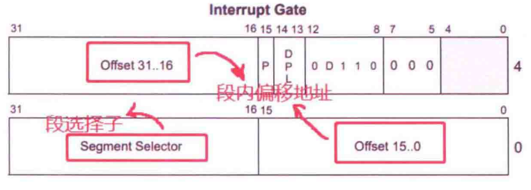
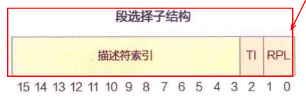
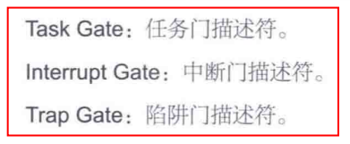
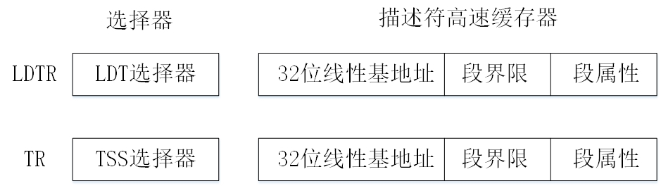
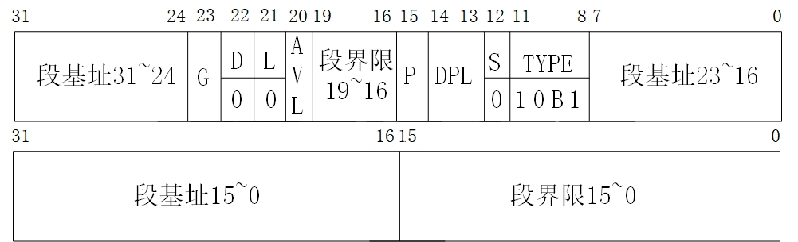
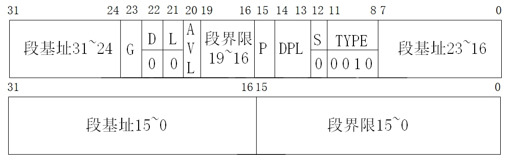
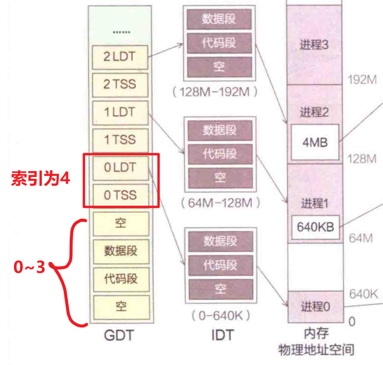

# 一、作用：
这是linux0.11的主干，其他的任何子系统都是以这个为基础发展调用的。所以，本质上来说，我们讲Linux的执行过程，就是讲的这个main函数的执行过程。把它理清楚了，Linux0.11也就完全明白了！

# 二、按代码逐行解析

## (一)COW问题
### 1.COW
为了保证在内核态中， 执行fork时，会导致Copy On Write (COW，写时复制)的系统优化机制失效。这是因为早期 COW 只针对用户页表：Linux 0.11 的 COW 逻辑只在用户页表（user page table）中标记 “只读共享”，内核页表（kernel page table）没有这个逻辑 —— 因为内核内存被所有进程共享，设计上就没考虑对内核栈做 COW。

正因为内核栈没有 COW 保护，一旦**父 / 子进程对栈做操作**（比如函数调用的返回、栈指针修改），**就会互相覆盖栈数据，导致崩溃。** 所以注释才要求：

1. fork `必须内联`（消除`函数调用 / 返回的栈`操作）；
2. main () 在 `fork 后不能用栈`（避免任何栈修改）；
3. 直到子进程执行 `execve，切换到用户空间`，才会`脱离这个共享内核栈`的风险。因为此时，，切换到用户空间，子进程重新建立齐了自己的用户空间，此时 COW 的问题才会消失。

>内核栈是 **“每进程私有**但**内核态共享”** 的：每个进程有自己的内核栈，但 fork 在内核态执行时，**子进程还没完成初始化，会临时共享父进程的内核栈；**

进程私有但内核态共享，这就很无奈啊~~

总的来说，就是：

> 在内核空间执行 fork 时，由于写时复制机制失效，父 / 子进程会共享内核栈；为了避免栈操作导致的数据错乱，要求 main () 在 fork 后完全不使用栈 —— 因此必须把 fork（及相关函数）实现为内联，消除函数调用 / 返回带来的栈操作。

### 2.对应fork实现：
```c
static inline _syscall0(int,fork)
static inline _syscall0(int,pause)
static inline _syscall1(int,setup,void *,BIOS)
static inline _syscall0(int,sync)
```
这些函数都是宏实现的：这里 _syscall0举例子：
```c
#define _syscall0(type, name)                 \
    type name(void)                           \
    {                                         \
        long __res;                           \
        __asm__ volatile("int $0x80"          \
                         : "=a"(__res)        \
                         : "0"(__NR_##name)); \
        if (__res >= 0)                       \
            return (type)__res;               \
        errno = -__res;                       \
        return -1;                            \
    }
```

### 3.宏定义内联为啥能优化运行性能和避免使用栈？ 
那么为什么内联了就能优化运行性能和避免使用栈？ 
————答案是“内联(宏定义)直接是结果的复制粘贴，将运行时的性能损耗提前至了编译期，既然是直接得到的结果，那么也就不存在调用函数一说了。所以内联(宏定义)既能优化运行性能，又可以避免函数调用，也就避免了使用栈。”
a.c
```c
#include <stdio.h>

#define add1(a, b) ((a) + (b))

int main(void)
{
    printf("result=%d", add1(1, 4));
    return 0;
}
```
这是使用宏定义，内联函数的汇编

```s
	.file	"a.c"
	.text
	.def	__main;	.scl	2;	.type	32;	.endef
	.section .rdata,"dr"
.LC0:
	.ascii "result=%d\0"
	.text
	.globl	main
	.def	main;	.scl	2;	.type	32;	.endef
main:
	pushq	%rbp
	movq	%rsp, %rbp
	subq	$32, %rsp
	call	__main
	movl	$5, %edx    # 这就是直接在编译期就计算出来了1+4的值了！没有add函数的任何汇编，更别谈及栈的替换了
	leaq	.LC0(%rip), %rcx
	call	printf
	movl	$0, %eax
	leave
	ret
	.ident	"GCC: (x86_64-posix-sjlj-rev0, Built by MinGW-W64 project) 8.1.0"
	.def	printf;	.scl	2;	.type	32;	.endef
```

b.c
```c
#include <stdio.h>

#define add1(a, b) ((a) + (b))

int main(void)
{
    printf("result=%d", add1(1, 4));
    return 0;
}
```
这是使用函数调用生成的汇编 
```s
	.file	"b.c"
	.text
	.globl	add2
	.def	add2;	.scl	2;	.type	32;	.endef
add2:                       # 这是add2函数，有明确的函数调用栈帧和栈数据的变化！
	pushq	%rbp
	movq	%rsp, %rbp
	movl	%ecx, 16(%rbp)
	movl	%edx, 24(%rbp)
	movl	16(%rbp), %edx
	movl	24(%rbp), %eax
	addl	%edx, %eax
	popq	%rbp
	ret
	.def	__main;	.scl	2;	.type	32;	.endef
	.section .rdata,"dr"
.LC0:
	.ascii "result=%d\0"
	.text
	.globl	main
	.def	main;	.scl	2;	.type	32;	.endef
main:
	pushq	%rbp
	movq	%rsp, %rbp
	subq	$32, %rsp
	call	__main
	movl	$4, %edx
	movl	$1, %ecx
	call	add2        # 这里就是会调用add2函数，栈会有变化。不想上面一样，直接宏定义替换。
	movl	%eax, %edx
	leaq	.LC0(%rip), %rcx
	call	printf
	movl	$0, %eax
	leave
	ret
	.ident	"GCC: (x86_64-posix-sjlj-rev0, Built by MinGW-W64 project) 8.1.0"
	.def	printf;	.scl	2;	.type	32;	.endef
```

显然，使用宏定义编译出来的汇编代码很简洁，并且关于add宏定义，直接替换成了结果`5`,但是传统的函数，就需要在运行期进行出栈入栈等等操作计算。
### 4.宏定义的优化本质
> 宏定义，本质上是将整个程序的性能提升过程前移，将运算推前到编译期优化，从而保全了运行期的极致性能。

## (二)自己模仿linus实现的用户层宏定义加法函数
```c
#include <stdio.h>
#include <errno.h>  // 补充errno头文件

// 2. 保留你提供的_syscall2宏（仅补充注释）
#define _syscall2(type, name, type1, arg1, type2, arg2) \
type name(type1 arg1, type2 arg2) { \
    long __res; \
    /* 模拟系统调用：替换int $0x80，避免调用不存在的内核系统调用 */ \
    /* 真实场景中此处是int $0x80，这里直接计算加法（仅演示） */ \
    __res = (long)(arg1 + arg2); \
    /* 保留原宏的返回值逻辑 */ \
    if (__res >= 0) return (type)__res; \
    errno = -__res; return -1; \
}

// 3. 用_syscall2宏生成add系统调用函数（核心：先定义，再调用）
static inline _syscall2(int, add, int, a, int, b)

// 4. 主函数：调用生成的add函数，而非直接调用宏
int main(void) {
    int result = add(1, 5);  // 调用宏生成的add函数
    printf("result=%d\n", result);    
    return 0;
}
```

预处理后，完成宏替换，如下：
```c
static inline int add(int a, int b) { long __res; __res = (long)(a + b); if (__res >= 0) return (int)__res; //得到了add函数了吧！
# 20 ".\\linus_define.c" 3
             (*_errno()) 
# 20 ".\\linus_define.c"
             = -__res; return -1; }


int main(void) {
    int result = add(1, 5);
    printf("result=%d\n", result);
    return 0;
}
```


## (三)系统调用精讲(以frok为例，详解fork)
### 1.fork调用详细宏转化
详细讲解这句话：
```c
static inline _syscall0(int,fork)
```
===
linus对于系统调用的实现如下：
宏定义：
```c
#define __NR_fork 2
```
```c
#define _syscall0(type, name)                 \
    type name(void)                           \
    {                                         \
        long __res;                           \
        __asm__ volatile("int $0x80"          \
                         : "=a"(__res)        \
                         : "0"(__NR_##name)); \
        if (__res >= 0)                       \
            return (type)__res;               \
        errno = -__res;                       \
        return -1;                            \
    }
```

所以调用了这个`_syscall0(int,fork)`函数，会生成：如下.i文件：
```c
int errno = 0;
static inline int fork(void)
{
    long __res;
    __asm__ volatile("int $0x80" : "=a"(__res) : "0"(2));
    if (__res >= 0)
        return (int)__res;
    errno = -__res;
    return -1;
}
```
由此可以看到，这里的`系统调用`马上就`变出来了！`很牛逼！
### 2.fork转化后源码详细讲解

详解如下：
- ✅️本质是通过 `int $0x80` 触发`内核中断`，调用`内核编号为 2` 的 `fork 系统调用`；
- ✅️接收`内核返回的结果`，处理错误（`设置 errno`）后返回`子进程 PID（成功）`或 `-1（失败）`；
- ✅️static inline 修饰符则是为了`消除函数调用的栈操作`（呼应我们之前聊的内核态 fork 栈安全问题）;

```c
__asm__ volatile("int $0x80" : "=a"(__res) : "0"(2));
```

|部分|含义|
|-|-|
|__asm__|       `GCC 内嵌汇编`的`关键字`，告诉编译器这里是`汇编代码（等价于 asm）`；|
|volatile|      `禁止编译器优化`这段汇编代码（必须执行，不能被省略 / 重排），`保证系统调用的原子性`；|
|"int $0x80"|   x86 架构的中断指令：触发 0x80 号软中断，跳转到内核的系统调用入口；|
|: "=a"(__res)| 输出约束：`"=a" 表示将 %eax 寄存器的值写入变量 __res`（`a 对应 %eax，= 表示只写`）；|
|: "0"(2)|      输入约束："0" 表示`复用第一个输出约束的寄存器`（即 `%eax`），将数值 2 `写入 %eax`；|

```c
if (__res >= 0) return (int)__res;
```
- 内核返回的 `__res >= 0` 表示`系统调用成功`：
- 父进程中，__res 是`子进程的 PID（正数）`；
- 子进程中，__res 是 0（这是 fork 的特性：`一次调用，两次返回`；
- 将 long 型的 __res 强转为 int 并返回（`PID 是整型`）。

//保持疑问？父子进程是怎么体现两次返回的？

====
```c
errno = -__res;
```
- 若 __res < 0，表示`系统调用失败`：内核返回的是`负数错误码`（比如 `-EAGAIN` 表示资源不足）；
- 将 __res 取反后赋值给 `errno`（errno 是`全局变量`，存储`用户态可识别的错误码`，比如 -(-EAGAIN) = EAGAIN）。

===
```c
return -1;
```
**系统调用失败时，返回 -1**（这是 fork 函数的约定：**失败返回 -1，成功返回子进程 PID/0**）。

### 3.为何说一次调用，父子进程两次返回？
https://www.doubao.com/thread/wef29de2fdea1b4a3


> 即，为什么一次 fork() 调用会有两次返回，而且`父进程返回子进程 PID`、`子进程返回 0`？

#### 1.核心结论
fork() 的 “两次返回”**不是函数本身返回了两次**，而是：**内核在创建子进程时**，会让**父进程和子进程共享同一份用户态代码执行流**，但**通过修改寄存器（%eax）的值**，让父子进程在 __asm__ 执行完后，走到**同一个 if 判断时**，得到不同的结果，最终表现为 **“一次调用，两次返回”**。

#### 2.fork的实现详细讲述
代码如下：fork实现：
```c
static inline _syscall0(int,fork)
```
这些函数都是宏实现的：这里 _syscall0举例子：
```c
#define _syscall0(type, name)                 \
    type name(void)                           \
    {                                         \
        long __res;                           \
        __asm__ volatile("int $0x80"          \
                         : "=a"(__res)        \
                         : "0"(__NR_##name)); \
        if (__res >= 0)                       \
            return (type)__res;               \
        errno = -__res;                       \
        return -1;                            \
    }
```
从这里可以看到，我们fork函数，通过`int $0x80`触发`内核中断`，调用`内核编号为 2` 的 `fork 系统调用`；
那么`int $0x80`中断的具体处理函数是什么呢？——在里面有定义：

#### 3.int $0x80触发，会发生什么？
##### 1.设置0x80的中断函数
我们在进程初始化sched_init(void)函数中，设置了系统调用0x80的中断处理函数，具体如下：
```c
void sched_init(void)
{
    int i;
    struct desc_struct *p;

    if (sizeof(struct sigaction) != 16)
        panic("Struct sigaction MUST be 16 bytes");
    set_tss_desc(gdt + FIRST_TSS_ENTRY, &(init_task.task.tss));
    set_ldt_desc(gdt + FIRST_LDT_ENTRY, &(init_task.task.ldt));
    p = gdt + 2 + FIRST_TSS_ENTRY;
    for (i = 1; i < NR_TASKS; i++)
    {
        task[i] = NULL;
        p->a = p->b = 0;
        p++;
        p->a = p->b = 0;
        p++;
    }
    /* Clear NT, so that we won't have troubles with that later on */
    __asm__("pushfl ; andl $0xffffbfff,(%esp) ; popfl");
    ltr(0);
    lldt(0);
    outb_p(0x36, 0x43);         /* binary, mode 3, LSB/MSB, ch 0 */
    outb_p(LATCH & 0xff, 0x40); /* LSB */
    outb(LATCH >> 8, 0x40);     /* MSB */
    set_intr_gate(0x20, &timer_interrupt);
    outb(inb_p(0x21) & ~0x01, 0x21);
    set_system_gate(0x80, &system_call); //主要看这里！定义了系统调用的中断处理！
}
```
我们看到最后一行：
```c
set_system_gate(0x80, &system_call); 
```
显然，含义就是设置了中断 0x80 的处理函数为 system_call，顾名思义为：系统调用！。
那么我们的`set_system_gate`函数的具体实现是什么呢？

##### 2.set_system_gate的实现
在我们的文件中，有定义`set_system_gate(n,addr)`函数：
```c
#define set_system_gate(n,addr) \
	_set_gate(&idt[n],15,3,addr) //描述的是，设置中断门n，类型为32位陷阱门，特权级为3，处理函数为addr
```
这里直接说_set_gate的作用，他是一个封装好的宏，用于设置中断门。参数分别表示：
`_set_gate(gate_addr,type,dpl,addr) `

- `gate_addr`：中断门的地址，表示写入**哪个中断描述符表（IDT）中的条目**。
- `type`：中断门的类型：门描述符的类型标识（`这是在x86 架构硬件层定义的，我们只能遵守`）：
- 15 = 0b1111 → 32 位`陷阱门`（Trap Gate）
- 其他常见值：14=32 位`中断门`（Interrupt Gate）
- `dpl`：中断门的特权级，决定了**哪些特权级**的代码可以触发该中断。
- `addr`：**中断处理函数的地址**，即当中断发生时，**CPU 会跳转到这个地址执行中断处理代码。**

##### 3._set_gate的源码

有了函数讲解，再来讲解具体实现，`_set_gate`函数的实现如下：
```c
#define _set_gate(gate_addr,type,dpl,addr) \
__asm__ ("movw %%dx,%%ax\n\t" \
	"movw %0,%%dx\n\t" \
	"movl %%eax,%1\n\t" \
	"movl %%edx,%2" \
	: \
	: "i" ((short) (0x8000+(dpl<<13)+(type<<8))), \
	"o" (*((char *) (gate_addr))), \
	"o" (*(4+(char *) (gate_addr))), \
	"d" ((char *) (addr)),"a" (0x00080000))
```
逐行解释：

这里就是直接向硬件编程了，需要结合`IDT`和`IDT表项`结构进行讲解，所以我们补充一下IDT和IDT表项的源码定义：

###### 1.中断描述符表

###### 1.1 idt_descr定义
idtr描述符寄存器定义：
在文件中，有定义`idt_descr`和`idt`的汇编层面定义：
```s
idt_descr:
	.word 256*8-1		# idt contains 256 entries
	.long idt
```
显然，这里给出了`idt`的汇编层面定义，首先指出，大小一共是256*8-1，因为一个`IDT表项`就是8字节。
其次，这里的idt表示中断描述符表的地址

###### 1.2 idt定义
以下代码，在内存中预留出一块`对齐到 8 字节边界`、包含 `256 个 8 字节表项`的`连续内存区域`，作为中断描述符表（IDT）的存储空间，并将所有表项`初始化为 0`。
```s
	.align 8
idt:	
    .fill 256,8,0		# idt is uninitialized
```
显然，这就是为其IDT和条目保存内存位置。


###### 1.3 C语言层面对idt、gdt的引用与细致解释
同时，在我们的文件中，有引用了`idt`的结构体：
> 注意，这里的引用是完完全全来自上面的里面定义的,因为汇编层面的东西不好操作，所以需要在C层面进行定义。其次，汇编层面仅仅定义了中断描述符的大小，没有定义细节，具体比较粗，而C语言层面定义了具体的中断描述符结构体，是细化的解释与实现。

```c
typedef struct desc_struct {
	unsigned long a,b; // 中断描述符，4+4=8字节。
} desc_table[256];

extern desc_table idt,gdt;
```
我们也发现，C语言中的解释，idt和gdt的表项 unsigned long 类型固定占 4 字节(Linux 0.11 对应的编译环境（gcc + x86 32 位）下)，因此 a 和 b 各占 4 字节，整个结构体总大小刚好 8 字节，完美匹配 x86 门描述符的长度。
由此，**也和汇编层面定义的结构一致。**

> 对比上面head.s的`.fill 256,8,0`,只定义了大小；而这里的结构体定义`unsigned long a,b;`，则是细化的解释与实现。

> 这里，如果你使用vscode或者其他编辑器，找不到idt的定义的，因为点击+跳转只在.c文件中进行，而idt的定义在.s文件中。
这也说明了，idt的定义是在汇编层面进行的，而C语言层面只是进行了引用。

###### 2.中断描述符
C语言定义：
```c
typedef struct desc_struct {
	unsigned long a,b; // 中断描述符，4+4=8字节。
} desc_table[256];
```
中断描述符图像：



可以看到，我们的中断描述符里面，主要是要找到段选择子和偏移地址。
那么这里的段选择子还会走我们的gdt过程，找到对应的段描述符，在找到对应的段基址。在于偏移地址相加，得到我们的中断处理函数地址！
所以，可以说，中断处理函数，只不过是在代码段寻址的基础上封装了一层中断描述符罢了。 

> 故，**中断只是触发了一次 “特殊的代码段寻址”，底层还是段式内存管理的核心规则。**

##### 4.结合idt结构，剖析_set_gate的源码
好了，终于把底层硬件知识都梳理完了，我们接下来再来看`_set_gate的源码`就简单多了！

```c
#define _set_gate(gate_addr,type,dpl,addr) \
__asm__ ("movw %%dx,%%ax\n\t" \
	"movw %0,%%dx\n\t" \
	"movl %%eax,%1\n\t" \
	"movl %%edx,%2" \
	: \
	: "i" ((short) (0x8000+(dpl<<13)+(type<<8))), \
	"o" (*((char *) (gate_addr))), \
	"o" (*(4+(char *) (gate_addr))), \
	"d" ((char *) (addr)),
    "a" (0x00080000))
```
##### 4.0\n\t的含义
这里的`\n\t`定义如下：
- \n（换行符）：

- 告诉汇编器 “上一条指令结束，下一条是新指令”；

- \t（制表符）：

- 纯格式美化，让汇编代码缩进对齐，提升可读性（非必需，但内核代码规范要求）；

> 简单说：\n 是 “让代码能跑”，\t 是 “让代码好看”。

###### 4.1 寄存器赋值
将上面的源码分为两部分，`：：`前面的是操作，`：：`后面的是赋值。CPU会`先执行`后面的赋值操作:
如下： 具体的解释包含在注释中了。
```c
	: "i" ((short) (0x8000+(dpl<<13)+(type<<8))), \ //这里i表示一个立即数(instant)，即0x8000+(dpl<<13)+(type<<8),后续对应%0
	"o" (*((char *) (gate_addr))), \    //这里o表示输出output，是gate_addr(即对应中断门)的地址，后续对应%1,后面会把具体中断处理函数的低4字节地址写入这里
	"o" (*(4+(char *) (gate_addr))), \ //这里o表示输出output，是gate_addr前面4字节(即对应中断门的高4字节)的地址，后续对应%2，后面会把具体中断处理函数的高4字节写入这里
	"d" ((char *) (addr)),  //这里的d表示%edx寄存器，即将我们传入的addr参数送入%edx寄存器中，后续对应%3
    "a" (0x00080000))  //这里的a表示%eax寄存器，即将0x00080000送入%eax寄存器中，后续对应%4
```
显然，
- 我们执行了"d"后，%edx寄存器中就存放了我们传入的addr参数，即中断处理函数地址。假如总的地址是：`0x12345678`
那么此时，%edx=0x12345678
- 我们执行了"a"后，%eax寄存器中就存放了0x00080000，即代码段选择子。
那么此时，%eax=0x00080000

**%edx和%eax的值，这两点要牢记！**

###### 4.2 寄存器操作
接下来讲解上面的寄存器操作代码：
```c
__asm__ (
    "movw %%dx,%%ax\n\t" \
	"movw %0,%%dx\n\t" \
	"movl %%eax,%1\n\t" \
	"movl %%edx,%2" \
```
###### movw %%dx,%%ax
注意这里是2字节大小操作，即movw，所以，这是把edx中的低16位(即addr低16位)写入eax的低16位。因为之前的"a"已经写入了%eax的高16位，还没有写入低16位。所以这里写入刚刚弥补，不冲突。

> 此时 eax = 0x0008（代码段选择子） + addr 低 16 位。


此时 eax = `0x0008`（`代码段选择子`） + addr 低 16 位 → 刚好对应门描述符的前 4 字节（地址低 16 位 + 代码段选择子）。

>注意，这个段选择子的值0x8000对应的索引就是1,因为我们的gdt[1]就是代码段描述符。
图示也可以支撑：1000结尾的//



>**这里，我们的中断描述符的前 4 字节填充好了！**

>时刻要牢记中断描述符图像：


###### movw %0,%%dx
%0 是输入参数，对应 `0x8000+(dpl<<13)+(type<<8)（标志位）；`
所以此处，是写入标志位到`edx的低16字节`。
而我们的`addr 高 16 位`自然保留在edx的高16字节中。这是`第一步"d"就保留的`，所以不动。

> 这里的标志位是：0x8000+(dpl<<13)+(type<<8)
对应中断描述符的第 3 字节（标志位）。
>时刻要牢记中断描述符图像：


>%0,1,2,3的语法解释
> 为啥对应着这个结果？GCC 内联汇编对输入参数的编号规则，所有输入 / 输出参数都会按出现**顺序被编号为 %0、%1、%2...**，这是**编译器的硬性规则**，和参数内容无关。

把标志位写入 edx 的`低 16 位（dx）`，此时 edx = 标志位 + addr 高 16 位（addr 指针的高 16 位自然保留）。
> 这里的中断参数是：_set_gate(&idt[n],15,3,addr)，所以type=15=>1111 dpl=3=>011,
> 这里的13是因为，dpl<<13是为了把dpl左移13位,dpl也刚刚是2位，0~4的大小
> 这里的8是因为，type<<8是为了把type左移8位，15代表是中断门


> 中断的类型：

|门描述符类型|	对应 type 数值	|二进制（4 位类型位）|	关键特点（补充理解）|
|-|-|-|-|
|Task Gate（任务门）	|5	|0101	|用于任务切换，Linux 0.11 几乎不用|
| Interrupt Gate（32 位中断门）	|14	|1110	|触发后自动关中断（IF=0），用于硬件中断|
| Trap Gate（32 位陷阱门）	|15	|1111	|触发后不关中断（IF=1），用于异常 / **系统调用**|

显然，这个中断门的架构是一致的：


> 而且，这里传入15的类型，也证明了，这就是系统调用！


所以，经过
```c
"movw %%dx,%%ax\n\t" \
"movw %0,%%dx\n\t" \
```
**这两步，%eax和%edx里面，存着的分别是中断描述符的前 4 字节（地址低 16 位 + 代码段选择子）和后 4 字节（ 地址高 16 位 +标志位）。**

那当前，下面的两部，就是把%eax和%edx里面的内容，写入对应的中断描述符地址。让其落实在内存层面，彻底生效！

###### movl %%eax,%1
上面已经做好了 eax 的赋值，即 eax = 0x0008（代码段选择子） + `addr 低 16 位`。现在将其写入对应的中断描述符地址。

> 把 eax 的 32 位值写入 %1（对应 `gate_addr 起始地址`），即完成`门描述符前 4 字节的写入`（地址低 16 位 + 代码段选择子）。

###### movl %%edx,%2
上面已经做好了 edx 的赋值，即 edx = `addr 高 16 位`+标志位  。现在将其写入对应的中断描述符地址。

>把 edx 的 32 位值写入 %2（对应 `gate_addr + 4 字节地址`），即完成门描述符后 `4 字节的写入`（标志位 + 地址高 16 位）。


====


那么具体的逻辑就到了fork的实现：
首先，我们的系统调用功能功能号是__NR_##name，对应在这里，就是__NR_fork，就是2。
2，将是系统调用表的索引，我们会调用这个索引处的函数：

#### 4.中断描述符设置好了，那么具体的中断处理函数sys_fork是什么呢？
前面，我们详细讲述了中断处理函数的前置处理流程：设置中断描述符。现在我们来看看具体的中断处理函数sys_fork。这是理解fork的关键。

首先，调用`_syscall0(int,fork)`函数，该宏会转化为如下：
```c
int errno = 0;
static inline int fork(void)
{
    long __res;
    __asm__ volatile(
        "int $0x80"     //调用中断号为0x80,说明进入系统调用
        : "=a"(__res)   //这里用于存储系统调用的返回值(也就是系统调用的功能号(2对应的系统中断就是fork))
        : "0"(2)        //"0"对应的是第一个绑定寄存器：'=a',即eax，将系统中断的功能号2,传入eax寄存器
    );
    if (__res >= 0)     //这里会使用前面的系统调用结果，判断系统调用是否成功
        return (int)__res;
    errno = -__res;
    return -1;
}
```
那么，`int $0x80`触发中断后，CPU会跳转到中断描述符表的0x80号处来找到中断处理函数：
```c
set_system_gate(0x80, &system_call); 
```
显然，我们的系统调用中断处理函数为`system_call`。那么system_call的具体实现是什么呢？
我们继续剖析：

#### 5.system_call的实现
在中，有一个system_call的外部引用
```c
extern void system_call(void);
```
那说明，system_call在其他文件中实现，我们继续查找。
这里就直接给出结论了：system_call在中实现。
> 可以看到，系统调用是如此重要！直接单独给他设置了一个文件！

来看看其中重要的代码：
```s
nr_system_calls = 74 # 说明了，系统调用一共有74个！
.globl system_call,sys_fork,timer_interrupt,sys_execve # 定义了系统调用的全局变量

system_call:
	cmpl $nr_system_calls-1,%eax
	ja bad_sys_call
	push %ds
	push %es
	push %fs
	pushl %edx
	pushl %ecx		# push %ebx,%ecx,%edx as parameters
	pushl %ebx		# to the system call
	movl $0x10,%edx		# set up ds,es to kernel space
	mov %dx,%ds
	mov %dx,%es
	movl $0x17,%edx		# fs points to local data space
	mov %dx,%fs
	call *sys_call_table(,%eax,4)
	pushl %eax
	movl current,%eax
	cmpl $0,state(%eax)		# state
	jne reschedule
	cmpl $0,counter(%eax)		# counter
	je reschedule

ret_from_sys_call:
	movl current,%eax		# task[0] cannot have signals
	cmpl task,%eax
	je 3f
	cmpw $0x0f,CS(%esp)		# was old code segment supervisor ?
	jne 3f
	cmpw $0x17,OLDSS(%esp)		# was stack segment = 0x17 ?
	jne 3f
	movl signal(%eax),%ebx
	movl blocked(%eax),%ecx
	notl %ecx
	andl %ebx,%ecx
	bsfl %ecx,%ecx
	je 3f
	btrl %ecx,%ebx
	movl %ebx,signal(%eax)
	incl %ecx
	pushl %ecx
	call do_signal
	popl %eax
3:	popl %eax
	popl %ebx
	popl %ecx
	popl %edx
	pop %fs
	pop %es
	pop %ds
	iret

.align 2
sys_fork:
	call find_empty_process
	testl %eax,%eax
	js 1f
	push %gs
	pushl %esi
	pushl %edi
	pushl %ebp
	pushl %eax
	call copy_process
	addl $20,%esp
1:	ret
```
从这里我们看到，主要是讲解`system_call`、`sys_fork`的实现。

我们挨个讲解：
##### 5.1 system_call的实现
```s
system_call:
	cmpl $nr_system_calls-1,%eax     # 比较系统调用号是否超过了总的系统调用数，这说明我们一定存在一个数组的结构，里面存放着所有的系统调用。提供索引访问具体的系统调用的形式。
	ja bad_sys_call # 如果eax里面的传参大于了总的系统调用号，说明我们调用的系统调用不存在，直接跳转bad_sys_call，下面紧接着就会讲解bad_sys_call的实现。本质就是直接诶返回-1
	push %ds    # 从这里开始就是系统调用成功了，我们需要做执行系统调用的前置工作：保存上下文。
	push %es
	push %fs
	pushl %edx
	pushl %ecx		# push %ebx,%ecx,%edx as parameters
	pushl %ebx		# to the system call
# 内核态
	movl $0x10,%edx        
# 0x10 是内核数据段的选择子（GDT中定义），0001 0000 由段选择子的结构可以得知其作用
# ┌─────────────────────────────────────┐
# │     15~3 索引     │ 2：TI │ 1~0：RPL │
# └─────────────────────────────────────┘
# RPL：取值一共4种，分别是0、1、2、3。越低，权限越高。
# TI：TI为0时，从 GDT（全局描述符表）中查找(绝大多数情况)，TI为1时，从 LDT（局部描述符表）中查找。

# 显然，这里的索引是0001 0，为2，那么就是内核数据段！
    mov %dx,%ds           # 把ds设置为内核数据段
    mov %dx,%es           # 把es设置为内核数据段

# 用户态：
    movl $0x17,%edx        
# 0x17 是用户数据段的选择子（供fs使用），0001 0111 由段选择子的结构可以得知其作用
# 显然，DPL=3，也就是用户态数据，并且TI为1，说明从LDT中访问！至于索引，依然是0001 0，为2，用户数据段！
    mov %dx,%fs           # fs指向用户数据段（内核态访问用户数据时用）

	call *sys_call_table(,%eax,4) # 调用系统调用表中的系统调用，eax中存放的是系统调用号，根据系统调用号，找到对应的系统调用函数。
#  函数指针的寻址方式： (基址寄存器, 索引寄存器, 比例)
#  sys_call_table 是内核定义的函数指针数组（每个元素是内核函数的地址，占 4 字节）。
#  目标函数地址 = sys_call_table + %eax × 4

	pushl %eax  #  保存系统调用的返回值（比如fork返回的PID/0）
	movl current,%eax   # current指向当前进程（父进程）的task_struct
	cmpl $0,state(%eax)		# 检查进程状态：state=0 → 就绪，非0 → 需调度

#TASK_RUNNING           0
#TASK_INTERRUPTIBLE	    1
#TASK_UNINTERRUPTIBLE	2
#TASK_ZOMBIE		    3
#TASK_STOPPED		    4

	jne reschedule      # 状态非0，说明自身还在运行。跳转到reschedule（进程调度）
	cmpl $0,counter(%eax)		# 检查进程时间片：counter=0 → 说明自身时间片用完了，进行调度
	je reschedule       # 时间片用完，跳转到reschedule
```

##### 5.2bad_sys_call的实现
```s
.align 2
bad_sys_call:
	movl $-1,%eax # 显然，直接返回-1，说明系统调用失败。
	iret
```

##### 5.3reschedule的实现
```s
.align 2
reschedule:
	pushl $ret_from_sys_call
	jmp schedule
```

##### 5.4ret_from_sys_call的实现
这里是系统调用返回核心逻辑。
主要是进行系统调用返回前`处理待处理信号`（Linux 信号机制的核心入口）；
本质上就是进行一系列检查，看是不是信号处理的时机，是的话，才处理信号。
```s
ret_from_sys_call:
#检查当前进程是否是任务0（内核空闲任务），如果是任务0，直接跳转到3:标签（即不处理信号）
    movl current,%eax     # 重新获取当前进程到eax（可能被调度过）
    cmpl task,%eax        # 检查是否是idle进程（task[0]）,这里是sched.c里面的全局变量
    je 3f                 # 是idle进程，跳过信号处理（idle无信号），直接恢复现场。
# https://chat.deepseek.com/share/e0pykx7uqsa049jt79

# 检查是否从内核态返回到用户态，只有在从内核态返回到用户态时才处理信号
# 检查原代码段选择符是否为0x0f（用户态代码段）
    cmpw $0x0f,CS(%esp)   # 检查旧代码段（CS）是否是用户态（0x0f=内核代码段） 因为0000 1111,这就是用户态代码段。
# CS = 0x20,这里CS(%esp) = 内核栈基址（% esp） + CS 偏移量 → 取出这个地址里的 16 位值（就是之前保存的旧CS值）。
    jne 3f                # 不是用户态，跳过（只处理用户态返回的信号），直接返回恢复现场的动作pop一系列。

# 检查原堆栈段选择符是否为0x17（用户态堆栈段）
    cmpw $0x17,OLDSS(%esp)# 检查旧栈段（SS）是否是用户数据段（0x17） 因为0001 0111,这就是用户态代码段。
# OLDSS	= 0x2C
    jne 3f                # 不是，跳过（只处理用户态返回的信号）

#检查是否有未阻塞的信号
    movl signal(%eax),%ebx    # 取出当前进程的待处理信号集
    movl blocked(%eax),%ecx   # 取出当前进程的阻塞信号集
    notl %ecx                 # 阻塞信号集取反（非阻塞的信号）
    andl %ebx,%ecx            # 计算：待处理 & 非阻塞 → 真正要处理的信号
    bsfl %ecx,%ecx            # 找第一个要处理的信号（最低位的1）
    je 3f                     # 无信号，跳转到3f

# 清除该信号位并调用该信号处理函数
    btrl %ecx,%ebx            # 清除已处理的信号位
    movl %ebx,signal(%eax)    # 更新进程的信号集
    incl %ecx                 # 信号编号从1开始（bsfl返回0表示第1位）
    pushl %ecx                # 信号编号入栈，作为do_signal的参数
    call do_signal            # 处理信号（调用信号处理函数）
    popl %eax                 # 弹出信号编号，恢复栈
```

##### 5.5恢复现场，iret返回用户态
这里显然，是和之前入栈的顺序刚刚相反，这里命名上写的都是自己的压栈的寄存器，不是CPU硬件层面的行为，CPU硬件层面的行为通过`iret一个指令`实现了。
```s
3:  popl %eax         # 弹出系统调用的返回值（之前pushl %eax）
    popl %ebx         # 恢复%ebx
    popl %ecx         # 恢复%ecx
    popl %edx         # 恢复%edx
    pop %fs           # 恢复%fs
    pop %es           # 恢复%es
    pop %ds           # 恢复%ds
    iret              # 中断返回：恢复用户态（CS/IP/EFLAGS/SS/ESP）

这是之前压栈的顺序：
#  * Stack layout in 'ret_from_system_call':
#  *
#  *	 0(%esp) - %oldeax
#  *	 4(%esp) - %oldebx
#  *	 8(%esp) - %oldecx
#  *	 C(%esp) - %oldedx
#  *	10(%esp) - %oldfs
#  *	14(%esp) - %oldes
#  *	18(%esp) - %oldds
#  *	1C(%esp) - %oldeip      # 从这里往下数的5个寄存器都是CPU硬件层面的行为，中断就必须会执行，往上的7个，是自己实现。 
#  *	20(%esp) - %oldcs
#  *	24(%esp) - %oldeflags   # 注意这里linus从这里往上就没有old前缀了，是不正确的，这里理应是old，因为是之前的。
#  *	28(%esp) - %oldesp
#  *	2C(%esp) - %oldss
```

##### 5.6为啥通过CS(%esp)就可以判断是否是内核态？(堆栈布局怎么来的？)
就上面的这段代码
```s
    cmpw $0x0f,CS(%esp)   # 检查旧代码段（CS）是否是内核态（0x0f=内核代码段）
```
等价于`CS+CS偏移量`
在开头，也有相关堆栈布局的论述：
```s
 * Stack layout in 'ret_from_system_call':
 *
 *	 0(%esp) - %oldeax
 *	 4(%esp) - %oldebx
 *	 8(%esp) - %oldecx
 *	 C(%esp) - %oldedx
 *	10(%esp) - %oldfs
 *	14(%esp) - %oldes
 *	18(%esp) - %oldds
 *	1C(%esp) - %oldeip      # 从这里往下数的5个寄存器都是CPU硬件层面的行为，中断就必须会执行，往上的7个，是自己实现。 
 *	20(%esp) - %oldcs
 *	24(%esp) - %oldeflags   # 注意这里linus从这里往上就没有old前缀了，是不正确的，这里理应是old，因为是之前的。
 *	28(%esp) - %oldesp
 *	2C(%esp) - %oldss

# 其实梳理下来，就是CPU会自动保存旧的堆栈系统、标志寄存器、代码寻址系统。
# 并且需要我们自己保存的是：%eax、%ebx、%ecx、%edx、%fs、%es、%ds。
```
怎么来的？

> 核心答案是：这是 CPU 执行int $0x80软中断时，**硬件级别的自动行为** ——CPU 会把**触发中断前的 CS 值（旧 CS）**压入内核栈，**内核只是按固定栈布局去读取这个值。**

然后我们也需要自己保存%eax、%ebx、%ecx、%edx、%fs、%es、%ds。

#### 6.sys_fork的实现
说了这么多，都是说的系统调用的总流程 ，还没有来到我们的sys_fork的实现，我们来看看我们的核心目标，sys_fork的实现。

刚刚说了：
```s
call *sys_call_table(,%eax,4) # 这里会调用我们的对应索引处的中断函数，那么，显然，之前fork中断存在eax里面的，是多少？回顾一下：
```
这里显然，是2，因为fork的中断号是2。
```c
int errno = 0;
static inline int fork(void)
{
    long __res;
    __asm__ volatile("int $0x80" : "=a"(__res) : "0"(2)); //具体是这里，"0"(2)复用了eax，写入2，所以，eax里面就是2。
    if (__res >= 0)
        return (int)__res;
    errno = -__res;
    return -1;
}
```
好了，那么我们肯定会找到sys_call_table的2号索引，也就是sys_fork的实现。

那么我们来看看sys_call_table的实现先。
##### 6.1 sys_call_table的实现
在中，有sys_call_table的实现：
```c
//这是在include/linux/sched.h中定义的函数指针
typedef int (*fn_ptr)();
//这里是在include/linux/sys.h中引用的sys_call_table中的函数
extern int sys_setup();
extern int sys_exit();
extern int sys_fork();
//......还有很多一直引用完全,具体实现，都是分布在`各个不同的文件中的`。

//这是在include/linux/sys.h中定义的sys_call_table
fn_ptr sys_call_table[] = { sys_setup, sys_exit, sys_fork, sys_read,
sys_write, sys_open, sys_close, sys_waitpid, sys_creat, sys_link,
sys_unlink, sys_execve, sys_chdir, sys_time, sys_mknod, sys_chmod,
sys_chown, sys_break, sys_stat, sys_lseek, sys_getpid, sys_mount,
sys_umount, sys_setuid, sys_getuid, sys_stime, sys_ptrace, sys_alarm,
sys_fstat, sys_pause, sys_utime, sys_stty, sys_gtty, sys_access,
sys_nice, sys_ftime, sys_sync, sys_kill, sys_rename, sys_mkdir,
sys_rmdir, sys_dup, sys_pipe, sys_times, sys_prof, sys_brk, sys_setgid,
sys_getgid, sys_signal, sys_geteuid, sys_getegid, sys_acct, sys_phys,
sys_lock, sys_ioctl, sys_fcntl, sys_mpx, sys_setpgid, sys_ulimit,
sys_uname, sys_umask, sys_chroot, sys_ustat, sys_dup2, sys_getppid,
sys_getpgrp, sys_setsid, sys_sigaction, sys_sgetmask, sys_ssetmask,
sys_setreuid,sys_setregid, sys_iam, sys_whoami };
```

而我们上述`系统调用(中断)引用`的函数的具体实现，都是分布在`各个不同的文件中的`。这里只是进行统一的描述。

##### 6.2 sys_fork的实现
sys_fork的具体实现也是汇编写的。来剖析剖析。
```s
.align 2
sys_fork:
	call find_empty_process # 调用C函数，寻找空闲的进程槽位
	testl %eax,%eax # 测试返回值（eax存放返回值）
	js 1f    # 如果返回值是负数（符号位为1），跳转到标签1（失败返回）
	push %gs    # 保存各个寄存器 (进行上下文切换的前兆)，这里也是下面copy_process的参数(部分参数)。
	pushl %esi  
	pushl %edi
	pushl %ebp
	pushl %eax
	call copy_process # 调用C函数，复制当前进程
	addl $20,%esp   # 清理栈（5个寄存器参数×4字节=20字节），防止栈不平衡。
1:	ret # 返回（1:标签，失败和成功都会到这里）
```
我们可以看到，这里具体是`find_empty_process`和`copy_process`两个函数。

###### 6.2.1 find_empty_process的实现

> 背景知识：Linux 采用了**进程槽位**的概念，每个进程都有一个唯一的进程槽位，用于存储进程的信息。当一个进程创建时，Linux 会遍历进程槽位，找到一个空闲的槽位，将新进程的信息存储在该槽位中。

```c
int find_empty_process(void)
{
	int i;
    //计算出最小的未使用的pid
	repeat:
		if ((++last_pid)<0) last_pid=1;
		for(i=0 ; i<NR_TASKS ; i++)
			if (task[i] && task[i]->pid == last_pid) goto repeat;//每次遍历一个pid，就遍历所有的进程，看看该pid是否被使用了。
    //找到空闲的进程槽位
	for(i=1 ; i<NR_TASKS ; i++)
		if (!task[i])
			return i;//最后返回进程槽位。[注意此时的pid和槽位毫无关系。独立的。]
	return -EAGAIN;
}
```

> 核心逻辑：这里是先找出未使用的最小的pid，再找出未使用的第一个空闲的进程槽位，返回进程槽位的索引。最后返回槽位。

###### 6.2.2 copy_process的实现
顾名思义，这就是复制进程的信息。所以，`在Linux中，创建新进程的逻辑就是复制母进程的信息`。
`有哪些具体的信息呢？直接看源码！`

>注意，这是fork的核心实现，显然，fork和copy同一意，所以，要特别理清这个函数。

```c
int copy_process(int nr,long ebp,long edi,long esi,long gs,long none,
		long ebx,long ecx,long edx,
		long fs,long es,long ds,
		long eip,long cs,long eflags,long esp,long ss)
    // 这里的参数有讲究：
    // 1、系统调用入口保存的：eip, cs, eflags, esp, ss（系统调用发生时自动压栈）
    // 2、sys_fork汇编代码push的：eax, ebp, edi, esi, gs
    // 3、系统调用入口push的：ebx, ecx, edx, fs, es, ds
{
	struct task_struct *p;
	int i;
	struct file *f;

	p = (struct task_struct *) get_free_page(); //分配4KB内存页作为任务结构体(这个就是进程的结构体，后详述)
	if (!p)
		return -EAGAIN; //这个是errno的错误码。意思为：没有空闲的进程槽位了。
	task[nr] = p;       //将新进程指针放入全局进程表
	
	// NOTE!: the following statement now work with gcc 4.3.2 now, and you
	// must compile _THIS_ memcpy without no -O of gcc.#ifndef GCC4_3

	*p = *current;	/* NOTE! this doesn't copy the supervisor stack */
    // 这里只复制了task_struct结构体，没有复制内核栈(即栈指针esp)。每个进程都有自己的内核栈。
    // 这里的内核栈如何体现的？不明白。

    // 这里开始初始化新进程属性
    p->state = TASK_UNINTERRUPTIBLE;  // 进程先设为不可中断状态
    p->pid = last_pid;                // 分配新PID(刚刚在find_empty_process中计算的)
    p->father = current->pid;         // 设置父进程PID
    p->counter = p->priority;         // 时间片计数器
    p->signal = 0;                    // 清除信号
    p->alarm = 0;                     // 清除闹钟
    p->leader = 0;                    // 不继承会话领导权
    p->utime = p->stime = 0;          // 清空用户/系统态时间
    p->cutime = p->cstime = 0;        // 清空子进程时间统计
    p->start_time = jiffies;          // 设置启动时间

    // 这里开始设置新进程的TSS，即任务状态段！
	p->tss.back_link = 0;
	p->tss.esp0 = PAGE_SIZE + (long) p;
	p->tss.ss0 = 0x10;
	p->tss.eip = eip;
	p->tss.eflags = eflags;
	p->tss.eax = 0;
	p->tss.ecx = ecx;
	p->tss.edx = edx;
	p->tss.ebx = ebx;
	p->tss.esp = esp;
	p->tss.ebp = ebp;
	p->tss.esi = esi;
	p->tss.edi = edi;
	p->tss.es = es & 0xffff;
	p->tss.cs = cs & 0xffff;
	p->tss.ss = ss & 0xffff;
	p->tss.ds = ds & 0xffff;
	p->tss.fs = fs & 0xffff;
	p->tss.gs = gs & 0xffff;
	p->tss.ldt = _LDT(nr);
	p->tss.trace_bitmap = 0x80000000;

    // 这里开始做浮点协处理器状态初始化
	if (last_task_used_math == current)
		__asm__("clts ; fnsave %0"::"m" (p->tss.i387));

    //这里开始复制内存空间，即，copy_mem()：复制页表，实现写时复制（Copy-on-Write）
	if (copy_mem(nr,p)) {
		task[nr] = NULL;
		free_page((long) p);
		return -EAGAIN;
	}

    //这里复制文件描述符引用计数，增加所有打开文件、工作目录、根目录、可执行文件的引用计数。
	for (i=0; i<NR_OPEN;i++)
		if ((f=p->filp[i]))//这里太牛逼了，用错误的语法，写正确的逻辑。先赋值指针，然后判断如果该文件描述符指针不为空，就增加引用计数。所以看似错了，实际上，大有妙处。
			f->f_count++;//如果文件描述符指针不为空，就增加引用计数。
            //这里看似f是一个局部变量，但是他和我们当前的进程指向一致，也确确实实改变了当前进程的文件描述符引用计数。
	if (current->pwd)   //进程当前工作目录的 inode 指针
		current->pwd->i_count++;
	if (current->root)  //进程根目录的 inode 指针
		current->root->i_count++;
	if (current->executable)    //进程可执行文件的 inode 指针
		current->executable->i_count++;

    //这里开始设置GDT描述符，在全局描述符表(GDT)中设置新进程的TSS和LDT描述符。
    //这里就又涉及到set_tss_desc、set_ldt_desc的细节了，接下来会详细讲解。
	set_tss_desc(gdt+(nr<<1)+FIRST_TSS_ENTRY,&(p->tss));
	set_ldt_desc(gdt+(nr<<1)+FIRST_LDT_ENTRY,&(p->ldt));
	p->state = TASK_RUNNING;	/* do this last, just in case */
	return last_pid;    //返回进程的PID
}
```

这里最值得讲解的就是`set_tss_desc`和`set_ldt_desc`:
>CPU不知道Linux的task_struct数据结构，它只知道：
- TSS描述符：告诉CPU在哪里保存/恢复任务状态
- LDT描述符：告诉CPU任务的私有内存描述符表在哪里
- 没有这两个GDT条目，CPU无法切换到这个任务！

所以，我们要设置TSS描述符和LDT描述符，才能让CPU切换到这个任务。

##### 6.3 set_tss_desc详细实现
set_tss_desc源码实现：
> 封装，实现了将GDT中的n号TSS描述符地址设置为addr(TSS结构体的地址)。
```c
/* 设置TSS描述符 */
#define set_tss_desc(n, addr) \
_set_tssldt_desc(((char *)(n)), ((int)(addr)), "0x89")
```
###### 6.3.1 tss结构体
这里需要讲解TSS的结构体：
> tss,全称：`task state segment` `任务状态字` ，是`保存和恢复上下文的`。这里是各个寄存器的值。
> tss结构体：
```c
//这个结构体一共有26项int，大小为4*26=104B
struct tss_struct {
    int back_link; //存储前面的任务的，形成了一个任务调用链，类似于函数调用栈，实现任务嵌套
    int esp0;   //内核栈指针，特权级0
    int ss0;    //内核栈段选择子
    int esp1;   //内核栈指针，特权级1
    int ss1;
    int esp2;   //内核栈指针，特权级2
    int ss2;
    int cr3;
    int eip;
    int eflags;
    int eax;
    int ecx;
    int edx;
    int ebx;
    int esp;    //内核栈指针，特权级3
    int ebp;
    int esi;
    int edi;
    int es;
    int cs;
    int ss;
    int ds;
    int fs;
    int gs;
    int ldt;
    int trace_bitmap;//trace_bitmap 是 x86 调试机制的一部分，用于跟踪任务的执行路径。
};
```
可以看到，tss中，基本都是寄存器的值。
###### 6.3.1.1 trace_bitmap
关于最后的trace_bitmap，可以查看这篇文章，是用来做调试的：

https://chat.deepseek.com/share/6zk2p79uuttv8paj3g

###### 6.3.2 tss描述符
就是存放的tss结构体的指针，指向tss结构体。




###### 6.3.3_set_tssldt_desc源码实现：
这里的源码一定要看上面的TSS描述符结构。
这里是直接将tss和idt一起共用这个函数了！

```c
/*
 * 设置TSS或LDT描述符
 * n: 描述符地址
 * addr: TSS或LDT的基地址
 * type: 描述符类型(0x89 for TSS, 0x82 for LDT)，这里很牛，通过一个标识符，简化代码
 */
#define _set_tssldt_desc(n, addr, type)              \
    __asm__("movw $104,%1\n\t"                       /* 描述符的第1个字节起，TSS/LDT段限长为104字节这也是TSS结构体的大小 */ \
            "movw %%ax,%2\n\t"                       /* 描述符的第3个字节起，将存放在ax里面TSS描述符的低16位地址在n中，即描述符地址中低16位中 */ \
            "rorl $16,%%eax\n\t"                     /* 循环右移16位：EAX = [高16位][低16位] → [低16位][高16位]，将EAX中的基地址高16位移到低16位 */ \
            "movb %%al,%3\n\t"                       /* 描述符的第5个字节起，存储TSS结构体地址的第24-16位到描述符的第5字节 */ \
            "movb $" type ",%4\n\t"                  /* 描述符的第6个字节起，设置描述符类型 */ \
            "movb $0x00,%5\n\t"                      /* 清除该字节(未使用) */ \
            "movb %%ah,%6\n\t"                       /* 描述符的第8个字节起，存储基地址第31-24位 */ \
            "rorl $16,%%eax"                         /* 恢复EAX原值：0x56781234 → 0x12345678*/
             ::\
            "a"(addr),              /* EAX = TSS/LDT基地址，即TSS结构体的地址，存入了EAX寄存器 */ \
            "m"(*(n)),              /* "m"告诉编译器，这是一个内存地址，描述符的第1个字节 */ \
            "m"(*(n + 2)),          /* 描述符的第3个字节 */ \
            "m"(*(n + 4)),          /* 描述符的第5个字节 */ \
            "m"(*(n + 5)),          /* 描述符的第6个字节 */ \
            "m"(*(n + 6)),          /* 描述符的第7个字节 */ \
            "m"(*(n + 7)))          /* 描述符的第8个字节 */ \
```

好了，TSS的具体调用是：
```c
_set_tssldt_desc(((char *)(n)), ((int)(addr)), "0x89")
```
那么0x89有何深意呢?
> 0x89是TSS描述符的类型，0x82是LDT描述符的类型。`这就是规定的，少问为什么。`


##### 6.4 set_ldt_desc详细实现
源码实现：
```c
/* 设置LDT描述符 */
#define set_ldt_desc(n, addr) \
_set_tssldt_desc(((char *)(n)), ((int)(addr)), "0x82")
```

###### 6.4.1. LDT描述符结构

和上面一致.
> 注意，在Linux0.11中，LDT没有像TSS一样，定义了具体的结构体，但是Linus在里面定义了所有描述符的通用结构体：
```c
typedef struct desc_struct {
	unsigned long a,b;
} desc_table[256];
```
所以，我们的LDT肯定也是8字节的结构。

##### 6.5再次回顾copy_process中的上下文设置
> 我们在copy_process中，设置了TSS描述符和LDT描述符。

```c
set_tss_desc(gdt+(nr<<1)+FIRST_TSS_ENTRY,&(p->tss));
set_ldt_desc(gdt+(nr<<1)+FIRST_LDT_ENTRY,&(p->ldt));
```

那么这里的`nr`是进程的编号，`FIRST_TSS_ENTRY`和`FIRST_LDT_ENTRY`是定义在中的宏，分别是：

```c
#define FIRST_TSS_ENTRY 4   //说明了GDT表中的第四项就是TSS描述符
#define FIRST_LDT_ENTRY (FIRST_TSS_ENTRY+1) // 说明了LDT描述符在GDT中的位置是TSS描述符的下一个，两者交替的。
```


这里的`(nr<<1)`是指进程的编号，每个进程都有一个TSS描述符和一个LDT描述符，所以，`(nr<<1)`就是进程的编号乘以2，得到的就是TSS描述符的位置。


好了，到了这里，我们的上下文信息TSS和LDT就在GDT表中设置完成了。

我们的进程的信息就copy完了。。

那么，我们有没有想过，为什么需要在copy_process的过程中设置TSS和LDT描述符呢？

##### 6.6为什么需要在copy_process的过程中设置TSS和LDT描述符呢？

1. 核心原因：硬件要求
x86 CPU不知道Linux的task_struct，`它只知道描述符表`：

> 没有GDT中的TSS/LDT描述符，CPU无法识别这个任务！
```c
// Linux视角：
struct task_struct *p = 分配内存();
p->pid = 123;
p->state = TASK_RUNNING;

// CPU视角：
TR寄存器 = 某个TSS选择子
LDTR寄存器 = 某个LDT选择子
```
2. 任务生命周期的完整性
创建任务必须完成的步骤：
```c
1. 分配内存 (get_free_page)
   ↓
2. 初始化数据结构 (*p = *current)
   ↓
3. 设置任务特定信息 (p->tss.eax = 0)
   ↓
4. ★★★ 注册到硬件 (set_tss_desc/set_ldt_desc) ← 关键！
   ↓
5. 加入调度队列 (task[nr] = p)
   ↓
6. 可以调度运行了
```
> 如果跳过第4步：调度器会选择这个任务，但switch_to()会失败，因为CPU找不到对应的TSS,即上下文丢失，自然无法进行上下文切换。


3. Linux的创建即完整的哲学
```c
// 不好的设计：分步创建
task_struct *create_task() { ... }
void setup_tss(task_struct *p) { ... }  // 需要额外调用
void setup_ldt(task_struct *p) { ... }  // 容易忘记！

// Linux 0.11的设计：一次完成
int copy_process(...) {
    // 创建+初始化+注册 一气呵成
    // 返回的任务已经是"可运行状态"
}
```


##### 6.7 LDT 和 GDT的对比

> LDT,局部描述符表，与GDT的对比如下：

LDT详解：Local Descriptor Table（局部描述符表）
LDT是x86保护模式中，`为每个任务（进程）提供的私有描述符表`，用于`定义任务专属的内存段。`

类比理解：
GDT（全局描述符表）：好比公司的公共通讯录，所有人都能用

LDT（局部描述符表）：好比每个员工的私人通讯录，只自己使用

核心区别：
|特性	|GDT	|LDT|
|-|-|-|
|作用范围|**全系统共享**|**单个任务私有**|
|数量|**系统一个**|**每个任务一个**|
|内容|内核段、TSS、LDT描述符等|任务的代码段、数据段|
|选择子TI位|TI=0|TI=1|

> 补充一个从属关系：也就是LDT描述符包含在GDT中。
但是LDT表，是独立的，位于中
```c
 /* ldt for this task 0 - zero 1 - cs 2 - ds&ss（进程的局部描述符表，x86 架构内存保护核心） */
    struct desc_struct ldt[3];
    /*
     * 背景：x86 架构中，LDT（局部描述符表）用于定义进程专属的内存段（与全局 GDT 区分）；
     * 数组结构（3 个描述符，固定用途，不可修改）：
     * - ldt[0]：空描述符（x86 要求 LDT 第一个描述符必须为 0，用于容错）；
     * - ldt[1]：代码段描述符（CS 段寄存器指向该描述符，定义进程代码段的基地址、限长、权限）；
     * - ldt[2]：数据段/栈段描述符（DS、SS 段寄存器指向该描述符，定义数据段/栈段的内存属性）；
     * 作用：通过 LDT 实现“进程地址空间隔离”——每个进程的 LDT 不同，确保进程只能访问自己的内存段。
     */
```
## (四)进程实现精讲
我们在前面的系统调用中，有这一个调用`reschedule`，这是进行进程调度的函数。我们将会讲解调度。但是在讲解之前，先明确什么是进程，Linux中进程的实现。

### 1.单个进程结构体源码
在Linux中，进程是有`专门的结构体`： task_struct实现的。
> 以前我们说的啥`进程是xxxxxx`,总是迷惑，但是现在有了源码，将不再迷惑。这就是`源码面前，没有迷惑`。
```c
struct task_struct {
/* these are hardcoded - don't touch */
	long state;	    /* -1 unrunnable, 0 runnable, >0 stopped */
                    //进程状态：标记进程当前的运行状态，决定调度器是否可选择该进程
	long counter;   //剩余时间片，实现时间片轮转调度的核心字段
	long priority;  //优先级。优先级越高，初始时间片越长
	long signal;    //未处理信号位图：标记进程收到但尚未处理的信号
	struct sigaction sigaction[32];//信号处理动作数组：定义每个信号的“处理方式”
	long blocked;	/* bitmap of masked signals */
                    //阻塞信号掩码：标记当前“被阻塞”的信号（被阻塞的信号不会触发处理，暂存于 signal 中）

/* various fields */
	int exit_code;  //进程退出码：存储进程的终止状态，供父进程回收。
                    //父进程通过 wait()/waitpid() 系统调用读取该值，判断子进程的终止原因。
	unsigned long start_code,end_code,end_data,brk,start_stack;
                    //进程内存区域边界：标记进程在内存中的代码段、数据段、栈段等关键地址，用于内存管理
	long pid,father,pgrp,session,leader;
                    //进程ID与亲属关系：``标识进程唯一``性及进程间的父子/组关系，用于进程管理
	unsigned short uid,euid,suid;
                    //用户身份标识：控制进程的文件访问权限、系统资源访问权限（Unix 安全模型核心）
	unsigned short gid,egid,sgid;
                    //用户组身份标识：控制进程的文件访问权限、系统资源访问权限（Unix 安全模型核心）
	long alarm;     //闹钟定时器：记录进程设置的闹钟时间，用于实现 alarm() 系统调用
	long utime,stime,cutime,cstime,start_time;
                    //进程时间统计：记录进程的 CPU 使用时间，用于资源统计和调度优化
	unsigned short used_math;
                    //数学协处理器使用标记：标记进程是否使用 80387 数学协处理器（早期 x86 架构专用）

/* file system info */
	int tty;		            //进程关联的终端设备号：标记进程对应的终端（如控制台、串口）
	unsigned short umask;       //文件创建掩码：控制新创建文件的默认权限（屏蔽指定的权限位）
	struct m_inode * pwd;       //进程当前工作目录的 inode 指针：指向当前工作目录的索引节点（inode）
	struct m_inode * root;      //进程根目录的 inode 指针：指向进程“根目录”的索引节点（默认是系统根目录 /）
	struct m_inode * executable;//进程可执行文件的 inode 指针：指向当前进程运行的可执行文件的索引节点
	unsigned long close_on_exec;//执行 exec() 时需关闭的文件掩码：标记进程中执行 exec() 系统调用后需自动关闭”的文件
	struct file * filp[NR_OPEN];//文件描述符表：存储进程打开的文件的指针数组，是进程访问文件的核心接口

/* ldt for this task 0 - zero 1 - cs 2 - ds&ss */
	struct desc_struct ldt[3];  //进程的局部描述符表,
    //  * 数组结构（3 个描述符，固定用途，不可修改）：
    //  * - ldt[0]：空描述符（x86 要求 LDT 第一个描述符必须为 0，用于容错）；
    //  * - ldt[1]：代码段描述符（CS 段寄存器指向该描述符，定义进程代码段的基地址、限长、权限）；
    //  * - ldt[2]：数据段/栈段描述符（DS、SS 段寄存器指向该描述符，定义数据段/栈段的内存属性）；

/* tss for this task */
	struct tss_struct tss;      //进程的任务状态段，x86架构进程切换核心
    //  * 核心逻辑：
    //  * - 进程切换时，内核将当前进程的寄存器状态保存到其 TSS 中；
    //  * - 加载新进程时，从其 TSS 中恢复寄存器状态，实现“上下文切换”；
};
```
### 2.整个系统的进程数组
```c
#define NR_TASKS 64 /*系统支持的最大进程数*/
extern struct task_struct *task[NR_TASKS];
//这里主要是想告知，我们这里不是static，所以加上extern，虽说这是冗余的.....
```
>非extern即static这是一个好习惯，可以查看这个目录测试[test_static_extern](../test_static_extern/extern.c)
可见，整个系统一共最多有64个进程。


### 3.初识进程INIT_TASK
这又是一个宏定义的。linus很喜欢用宏。
```c
/**/
#define INIT_TASK                           \
    /* state etc */ {                       \
        0, /* 进程0一开始就运行哦，所以为0 */                         \
            15,/*时间片为15ms*/                             \
            15, /*优先级为15*/                            \
            /* signals */ 0,  /*最开始也没收到什么信号，位图为0*/               \
            {                               \
                {},   /*定义每一个信号的处理方式，目前为0*/                      \
            },                              \
            0,      /*当期那被阻塞的信号为0，掩码位0了*/                        \
            /* ec,brk... */ 0,             \
            0,  /*代码段起地址*/                            \
            0,   /*代码段终地址*/                            \
            0,  /*数据段终地址*/                            \
            0,  /*堆段当前末尾地址*/                            \
            0,   /*用户栈起始地址*/                           \
            /* pid etc.. */ 0,/*进程id*/              \
            -1,    /*父进程ID*/                         \
            0,  /*进程组ID*/                            \
            0,   /*会话ID*/                           \
            0,   /*会话领导进程标记，1 表示是会话 leader，0 不是*/                           \
            /* uid etc */ 0,  /*真实用户ID*/               \
            0,      /*有效用户ID*/                        \
            0,      /*保存的用户ID*/                       \
            0,      /*真实组ID*/                        \
            0,     /*有效组ID*/                         \
            0,     /*保存的组ID*/                         \
            /* alarm */ 0,/*闹钟定时器，记录进程设置的闹钟时间*/                  \
            0,     /*用户态 CPU 时间*/                         \
            0,    /*内核态 CPU 时间*/                          \
            0,    /*子进程用户态总时间*/                          \
            0,   /*子进程内核态总时间*/                           \
            0,   /*进程创建时间*/                           \
            /* math */ 0,                   \
            /* fs info */ -1, /*进程关联的终端设备号，-1表示还没有关联，说明进程0没有能力与屏幕交互*/               \
            0022,    /*文件创建掩码：控制新创建文件的默认权限*/                       \
            NULL,   /*进程当前工作目录的 inode 指针*/                        \
            NULL,   /*进程根目录的 inode 指针*/                        \
            NULL,   /*进程可执行文件的 inode 指针*/                        \
            0,  /*执行 exec() 时需关闭的文件掩码*/                            \
            /* filp */ {                    \
                NULL,    /*文件描述符表：存储进程打开的文件的指针数组*/                   \
            },  
            /* ldt */                             \
            {                               \
                {0, 0},   /*空描述符,x86 要求 LDT 第一个描述符必须为 0，用于容错*/                  \
                {0x9f, 0xc0fa00},/*代码段描述符*/ \
                {0x9f, 0xc0f200}, /*数据段/栈段描述符*/          \
                /*作用：通过 LDT 实现“进程地址空间[准确说，是线性地址空间，但是线性地址转化为物理地址也会自然隔离(因为页框号左移12位就是物理地址)，所以可以说物理地址隔离]隔离”——每个进程的 LDT 不同，确保进程只能访问自己的内存段。*/
            },                              \
            /*tss*/ 
            {                           \
            0, /*前面的tss没有，因为这是第一个进程*/                       \
            PAGE_SIZE + (long)&init_task, /*设置内核栈指针，因为这是内核层，所以是esp0*/\
            0x10,/*内核栈段选择子,显然，是0001 0000 ,第二个代码段*/\ 
            0, 0, 0, 0, (long)&pg_dir, /*这是cr3寄存器的值，显然存放的是页目录表地址*/     \
            0, 0, 0, 0, 0, 0, 0, 0, 0,/**/  \
            0, 0x17, 0x17, 0x17, 0x17,/*0x17是用户栈段选择子，显然是0001 0111,是用户代码段*/  \
            0x17, 0x17, _LDT(0),/*这是第一个TSS，所以是0*/    \
            0x80000000, /*禁止用户程序直接访问任何I/O端口（最高位1），同时不启用硬件单步调试（最低位0）。*/      \
            {}/**/      \
            }
,
}
```


## (五)进程调度精讲
好了，我们讲完了进程的实现，现在可以专注讲解调度函数`reschedule`了：
```s
system_call:
	cmpl $nr_system_calls-1,%eax
	ja bad_sys_call
	push %ds
	push %es
	push %fs
	pushl %edx
	pushl %ecx		# push %ebx,%ecx,%edx as parameters
	pushl %ebx		# to the system call
	movl $0x10,%edx		# set up ds,es to kernel space
	mov %dx,%ds
	mov %dx,%es
	movl $0x17,%edx		# fs points to local data space
	mov %dx,%fs
	call *sys_call_table(,%eax,4)
	pushl %eax
	movl current,%eax
	cmpl $0,state(%eax)		# state
	jne reschedule
	cmpl $0,counter(%eax)		# counter
	je reschedule
```
显然，这个就是进程调度的函数。那么我们深入讲解之。
reschedule的实现如下：
```s
.align 2
reschedule:
	pushl $ret_from_sys_call
	jmp schedule
```
所以重点在`schedule`函数。

### 1. schedule函数的实现
函数出处：

linus的原注释如下，可见他给予这段代码高度的评价!：
```c
/*
 *  'schedule()' 是调度器核心函数。这是一段健壮的优质代码！
 * 通常无需对其做任何修改，因为它在所有场景下都能稳定工作
 *（例如为IO密集型进程提供良好的响应性等）。
 * 唯一可能需要关注的地方是此处的信号处理程序代码。
 *
 *   注意！0号任务是“空闲”任务，仅当无其他任务可运行时才会被调用。
 * 该任务无法被终止，也不能进入睡眠状态。task[0]中的“状态”
 * 字段信息永远不会被使用。
 */
```
具体如下：
```c
void schedule(void)
{
    int i, next, c; // next：选中的下一个要运行的任务ID，c：当前找到的最大counter值，p：任务结构体指针的指针（二级指针）
    struct task_struct **p; // p：任务结构体指针的指针（二级指针），用于遍历任务队列，可以持久化更改结构体指针的内容，当然，指针地址变了，该结构体指向也就可能变了。

//第一部分：信号和唤醒处理
//"检查定时器（alarm），唤醒所有已收到信号的可中断任务"
    
    for (p = &LAST_TASK; p > &FIRST_TASK; --p) // 从LAST_TASK到FIRST_TASK反向遍历所有任务（任务0是空闲任务）
        if (*p) // 检查任务槽是否被占用（不为NULL）,只有被占用了，才会继续
        {
            if ((*p)->alarm && (*p)->alarm < jiffies) // 定时器检查，如果任务设置了alarm且alarm时间已到（jiffies是系统时钟滴答计数）
            {
                (*p)->signal |= (1 << (SIGALRM - 1));// 给任务发送SIGALRM信号（信号位图中设置相应位）
                (*p)->alarm = 0; // 清空alarm值
            }
            if (((*p)->signal & ~(_BLOCKABLE & (*p)->blocked)) &&
                (*p)->state == TASK_INTERRUPTIBLE)// 如果任务有未阻塞的信号且处于可中断睡眠状态
                (*p)->state = TASK_RUNNING;// 则将其状态改为就绪状态（TASK_RUNNING）
        }

//  第二部分：寻找合适任务
// 调度，选出下一个任务。
    while (1)
    {
        c = -1; //初始化最大counter (时间片)值为-1（确保任何正counter都能被选中）
        next = 0;//默认选择任务0，怠速任务
        i = NR_TASKS; //任务总数
        p = &task[NR_TASKS]; // 指向最后一个任务的指针
        while (--i) // 寻找counter最大的就绪任务
        {
            if (!*--p)//如果任务槽为空则跳过
                continue;
            if ((*p)->state == TASK_RUNNING && (*p)->counter > c)// 如果任务处于就绪状态且其counter大于当前最大值c
                c = (*p)->counter, next = i;// 更新最大counter值c和下一个要运行的任务ID next
        }//如此，当遍历完所有任务后，next就指向了counter最大的就绪任务（如果有）
        if (c)// 如果找到一个就绪任务（c大于-1）
            break;// 唯一退出的条件。
        //如果遍历完上述的，所有就绪任务的counter都为0，继续下面的时间片重新分配
        for (p = &LAST_TASK; p > &FIRST_TASK; --p)
            if (*p)
                (*p)->counter = ((*p)->counter >> 1) +
                                (*p)->priority;//经典的优先级衰减+补偿算法,重新分配时间片,实现了动态优先级和公平调度
    }

// 第三部分：任务切换
    switch_to(next);
    // 切换到选中的下一个任务（next），这是最核心的最底层的切换操作。总的来说，就是
    // 1. 保存当前任务上下文，恢复下一个任务的上下文
    // 2. 通过TSS（任务状态段）和硬件任务切换实现的
}
```
下面，自然要来讲解上下文切换的终极boss：`switch_to`.

### 2. switch_to函数的实现

switch_to依然是定义在中的宏：
> 总功能：定义宏switch_to(n)，n是要切换到的任务号
```c
#define switch_to(n)                                 \ 
    {                                                \ 
        struct                                       \
        {                                            \
            long a/*偏移*/, b/*段选择子*/;            \ //存储欲切换到的目的进程远跳转的地址（段选择子+偏移）
        } __tmp;                                     \  
        __asm__("cmpl %%ecx,current\n\t"             \//比较`ecx寄存器`和`current变量`,前者保存着欲切换的目的进程task[n]的地址，后者是当前源任务指针
                "je 1f\n\t"                          \//这里是为了避免自己和自己切换，如果是自己，立马跳到下面的1f标签处，
                "movw %%dx,%1\n\t"                   \//移动指令：将dx的值移动到`%1`,即__tmp.b, dx寄存器保存着`_TSS(n)`（新任务的TSS段选择子）,在构建`远跳转描述符（TSS选择子+偏移）`
                "xchgl %%ecx,current\n\t"            \//交换指令：交换`ecx`和`current(存着原任务的指针)`的值, current = 新任务指针，ecx = 原任务指针
                "ljmp *%0\n\t"                       \//远跳转指令：长跳转到%0指向的地址，%0对应`__tmp.a`（临时结构的第一个long），*%0表示`间接寻址`，从`__tmp.a读取跳转目标`。这是关键的任务切换指令，会`触发CPU的上下文切换`。因为已经跑到目的段选择子对应的偏移上去了，开始重新运行目的任务的代码段了！

                //进程切换主体在上面，下面就是协处理器的过程了。
                "cmpl %%ecx,last_task_used_math\n\t" \//数学协处理器清理
                "jne 1f\n\t"                         \//
                "clts\n"                             \//
                "1:"                                 \//标签1,
                ::                                   \//
                "m"(*&__tmp.a),                      \//%0，偏移
                "m"(*&__tmp.b),                      \//%1，段选择子
                "d"(_TSS(n)),                        \//%2,将目的任务n的TSS段选择子移动到edx寄存器
                "c"((long)task[n]));                 \//%3,将目的任务n的指针移动到ecx寄存器
    }
```

这里补充`_TSS宏`：

依然是在：中的宏：
```c
//说明了GDT表中的第四项就是TSS描述符
#define FIRST_TSS_ENTRY 4   
//计算得到的是任务n的TSS段选择子，这个TSS在之前的copy_process已经设置好了！现在直接取出来！
#define _TSS(n) ((((unsigned long) n)<<4)+(FIRST_TSS_ENTRY<<3))
//(((unsigned long) n)<<4)是指每一个TSS和LDT一起占用8字节，所以一起是16字节，每个TSS的选择子的离第一个TSS的偏移是*16的
//(FIRST_TSS_ENTRY<<3)是指GDT表中第4项的偏移，每个描述符占用8字节(所以<<3)，所以第4项的偏移是32字节
//两次偏移加在一起，即 ((((unsigned long) n)<<4)+(FIRST_TSS_ENTRY<<3))，就是我们的目的切换任务的地址了！
```
如图，第一个TSS和LDT的位置：


