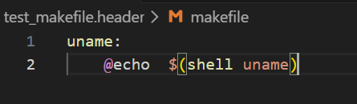
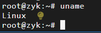

# 一、源码
makefile.header源码请点击此处


# 二、作用
这段代码是 Makefile 中`跨平台编译配置`的核心逻辑，目的是根据操作系统（`Linux/macOS Darwin`）自动适配 `32 位 x86 汇编器`、`编译器`、`链接器`等工具的参数和路径，确保`内核 / 底层程序`能在`不同系统下稳定编译`。
说白了就是在不同的操作系统下，使用不同的工具链（如 GCC、Clang）进行编译，确保代码能在目标平台运行。

# 三、逐行解析
## (一)获取当前操作系统类型
```makefile
UNAME := $(shell uname) #获取当前操作系统名称并赋值给变量UNAME；
```
例如，在我的windows下：



在我的Ubuntu下：


## (二)条件判断，如果当前的OS是Linux的话，进行的各种编译、链接赋值等

```makefile
ifeq ($(UNAME), Linux) # Makefile 的相等判断，满足条件则执行块内配置；
	AS	= as --32  # 定义汇编器AS的命令和参数，Linux 系统默认的 GNU 汇编器；强制生成32 位 x86 汇编目标文件（即使主机是 64 位 Linux，也能编译 32 位程序）；

	LD	= ld    # 定义链接器LD为 Linux 系统默认的 GNU 链接器ld。
	#LDFLAGS = -m elf_i386 -x   # 指定链接器生成32 位 ELF 格式的目标文件 / 可执行文件；
	LDFLAGS = -m elf_i386   # 指定链接器生成32 位 ELF 格式的目标文件 / 可执行文件
	CC	= gcc   # 定义编译器CC为 Linux 系统默认的 GCC。

# 定义 C 编译器的核心参数（最关键的一行）； 
# -g,生成调试信息
# -m32，编译 32 位 C 程序
# -fno-builtin	禁用 GCC 内置函数（如printf/memcpy）	老式内核自己实现了这些函数，避免编译器替换成内置版本导致冲突
# -fno-stack-protector	禁用栈保护机制（Stack Smashing Protection）	现代 GCC 默认开启栈保护（插入 canary 值），老式内核无此逻辑，会导致编译 / 运行错误
# -fomit-frame-pointer	省略帧指针（ebp 寄存器）	节省寄存器资源（32 位系统寄存器少），提升内核执行效率
# -fstrength-reduce	强度削减优化（如把乘法换成加法）	老式编译器的经典优化，减少内核指令数
# 注释的-Wall	开启所有警告	注释掉是因为老式内核代码有大量 “警告但不报错” 的写法，避免编译时刷屏

	CFLAGS  = -g -m32 -fno-builtin -fno-stack-protector -fomit-frame-pointer -fstrength-reduce #-Wall

# 定义 C 预处理器CPP,并且-nostdinc，不使用系统默认的头文件目录（如/usr/include）；
	CPP	= cpp -nostdinc
# 定义归档工具（ar）、符号剥离工具（strip）、目标文件转换工具（objcopy）为 Linux 系统默认版本；
	AR	= ar
	STRIP = strip
	OBJCOPY = objcopy
# 尝试获取 GCC 的版本号（代码未实际使用，属于预留逻辑）；
	# we should use -fno-stack-protector with gcc 4.3
	gcc_version=$(shell ls -l `which gcc` | tr '-' '\n' | tail -1)
endif
```

## (三)条件判断，如果当前的OS是macOS（Darwin）的话，进行的各种编译、链接赋值等
```makefile
ifeq ($(UNAME), Darwin)
	AS	= i386-elf-as --32
	LD	= i386-elf-ld
	#LDFLAGS = -m elf_i386 -x 
	LDFLAGS = -m elf_i386
	#CC	= i386-elf-gcc-4.3.2
	CC	= i386-elf-gcc
	CFLAGS  = -gdwarf-2 -g3 -m32 -fno-builtin -fno-stack-protector -fomit-frame-pointer -fstrength-reduce #-Wall

	#CPP	= i386-elf-cpp-4.3.2 -nostdinc
	CPP	= i386-elf-cpp -nostdinc
	AR	=i386-elf-ar
	STRIP = i386-elf-strip
	OBJCOPY = i386-elf-objcopy
endif
```