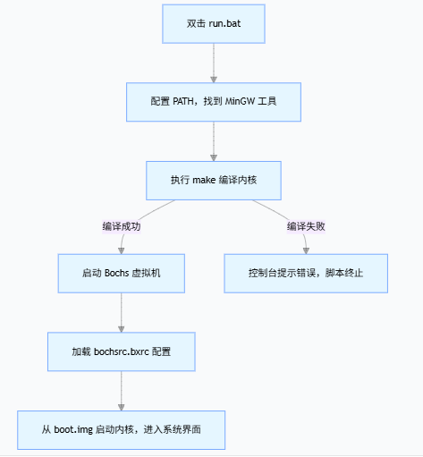

# 一、作用
这份 run.bat 是 Windows 下`一键编译并启动` Tinix/Linux 0.11 内核的`批处理脚本`，核心是 `“配置编译环境 → 编译内核 → 启动虚拟机运行”` 的自动化流程
# 二、核心流程
把 “手动配置环境变量、敲编译命令、启动虚拟机” 这三步操作打包成一个批处理文件，双击 run.bat 就能一键完成：

- ✅ 自动配置 MinGW 编译环境（找到 `gcc/make 等工具`）
- ✅ 自动编译内核生成 `boot.img 引导镜像`
- ✅ 自动启动 `Bochs 虚拟机，加载内核并运行`

不用每次手动输命令，极大简化了 `“编译 - 运行”` 的流程，是嵌入式 / 内核开发中`最常用的自动化方式。`

> 太帅了，再带环境，并且将环境安装进PATH，这样就可以在任何目录下直接运行 run.bat 了。

# 三、逐行代码解释

## (一)第一行，「给系统 “指路”」的命令，解决 “找不到 gcc/make” 的问题：

```bat
@SET PATH=..\MinGW32\bin;..\..\MinGW32\bin;..\..\..\MinGW32\bin;%PATH%
```

- @：“安静模式”—— 执行这条命令时，不在控制台打印命令本身（只做事，不说话）；
- SET PATH=...：修改 Windows 的「环境变量 PATH」（系统找可执行程序的 “通讯录”）；
- ..\MinGW32\bin：告诉系统 “去当前文件夹的上一级找 MinGW 的工具（gcc/make）”；
- 连续写 3 层 ../ 是 “容错设计”—— 不管脚本放在哪个子目录（比如 code/、code/day1/、code/day1/build/），都能找到 MinGW；
- ;%PATH%：保留系统原来的 “通讯录”（比如系统自带的 cmd、notepad），`只新增 MinGW 的路径`，`不覆盖原有内容。`

## (二)第二行，「编译内核」的命令：make
```bat
make
```
本质是调用 MinGW 中的 mingw32-make.exe（MinGW 把它重命名为 make.exe，和 Linux 命令一致）；
执行后，脚本会读取当前目录的 Makefile，按里面的规则编译：
① 把 `.c` 文件编译成 `.o` 目标文件；
② 链接所有 `.o/.a` 文件生成 `tools/system.exe`；
③ 打包生成 `boot.img` 引导镜像；

## (三)第三行，「启动虚拟机」的命令：bochs
```bat
..\bochs-2.3.6\bochs -f bochsrc.bxrc -q
```
`-f bochsrc.bxrc`：指定虚拟机的配置文件（就是你之前问的 bochsrc.bxrc），告诉 Bochs：
- ✅ 分配 32MB 内存；
- ✅ 加载 boot.img 软盘镜像；
- ✅ 从 A 盘启动；
- ✅ 禁用鼠标、用美式键盘；

`-q`：“静默启动”—— 跳过 Bochs 启动时的交互式菜单（比如不用手动选 “Start”），直接进入虚拟机运行界面。

# 四、整体流程
